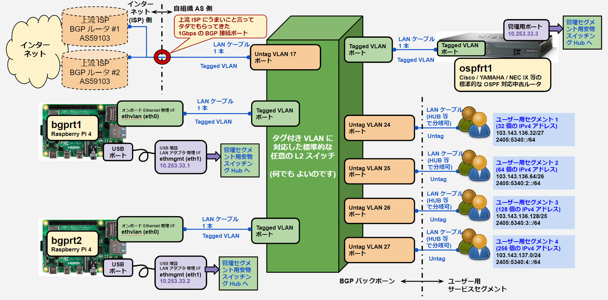

# IPA Easy BGP Starter Kit へようこそ
IPA Easy BGP Starter Kit は、Raspberry Pi 4 を用いて 2 台の完全冗長な IPv4 / IPv6 デュアル・スタックの BGP フルルート・ルータを構築し、上流 ISP の BGP ルータと接続して、自組織の AS をインターネットに接続するための Raspberry Pi 4 の SD カードのイメージを自動的に構築し、必要最小限の初期設定と BGP 接続を自動的に行なうためのツールキットです。


本ツールキットを利用すれば、JPNIC や上流 ISP にうまいこと言ってもらってきた AS 番号、IP アドレスおよび BGP 接続用ポートを活用して、あなたのシステムをインターネットに直接接続し、何百個もの IPv4 アドレスや IPv6 ネットワーク・セグメントに、数え切れない多数のサーバー・コンピュータやワークステーションを接続して、ファイアウォールや NAT などの厄介な添加物なしに、自然なインターネットとの触れ合いを楽しむことができるのです。


<!-- TOC -->

- [IPA Easy BGP Starter Kit へようこそ](#ipa-easy-bgp-starter-kit-%E3%81%B8%E3%82%88%E3%81%86%E3%81%93%E3%81%9D)
    - [IPA Easy BGP Starter Kit について](#ipa-easy-bgp-starter-kit-%E3%81%AB%E3%81%A4%E3%81%84%E3%81%A6)
    - [従来の課題](#%E5%BE%93%E6%9D%A5%E3%81%AE%E8%AA%B2%E9%A1%8C)
    - [IPA Easy BGP Starter Kit による解決方法](#ipa-easy-bgp-starter-kit-%E3%81%AB%E3%82%88%E3%82%8B%E8%A7%A3%E6%B1%BA%E6%96%B9%E6%B3%95)
    - [IPA Easy BGP Starter Kit の主な内容](#ipa-easy-bgp-starter-kit-%E3%81%AE%E4%B8%BB%E3%81%AA%E5%86%85%E5%AE%B9)
    - [IPA Easy BGP Starter Kit の設定サンプルの想定ネットワーク](#ipa-easy-bgp-starter-kit-%E3%81%AE%E8%A8%AD%E5%AE%9A%E3%82%B5%E3%83%B3%E3%83%97%E3%83%AB%E3%81%AE%E6%83%B3%E5%AE%9A%E3%83%8D%E3%83%83%E3%83%88%E3%83%AF%E3%83%BC%E3%82%AF)
        - [AS 番号などの基礎的な情報](#as-%E7%95%AA%E5%8F%B7%E3%81%AA%E3%81%A9%E3%81%AE%E5%9F%BA%E7%A4%8E%E7%9A%84%E3%81%AA%E6%83%85%E5%A0%B1)
            - [上流 ISP #1 との接続パラメータ (本キットで構築する `bgprt1` という BGP ルータが接続)](#%E4%B8%8A%E6%B5%81-isp-1-%E3%81%A8%E3%81%AE%E6%8E%A5%E7%B6%9A%E3%83%91%E3%83%A9%E3%83%A1%E3%83%BC%E3%82%BF-%E6%9C%AC%E3%82%AD%E3%83%83%E3%83%88%E3%81%A7%E6%A7%8B%E7%AF%89%E3%81%99%E3%82%8B-bgprt1-%E3%81%A8%E3%81%84%E3%81%86-bgp-%E3%83%AB%E3%83%BC%E3%82%BF%E3%81%8C%E6%8E%A5%E7%B6%9A)
            - [上流 ISP #2 との接続パラメータ (本キットで構築する `bgprt2` という BGP ルータが接続)](#%E4%B8%8A%E6%B5%81-isp-2-%E3%81%A8%E3%81%AE%E6%8E%A5%E7%B6%9A%E3%83%91%E3%83%A9%E3%83%A1%E3%83%BC%E3%82%BF-%E6%9C%AC%E3%82%AD%E3%83%83%E3%83%88%E3%81%A7%E6%A7%8B%E7%AF%89%E3%81%99%E3%82%8B-bgprt2-%E3%81%A8%E3%81%84%E3%81%86-bgp-%E3%83%AB%E3%83%BC%E3%82%BF%E3%81%8C%E6%8E%A5%E7%B6%9A)
            - [本キットで構築する BGP ルータ bgprt1 の設定情報](#%E6%9C%AC%E3%82%AD%E3%83%83%E3%83%88%E3%81%A7%E6%A7%8B%E7%AF%89%E3%81%99%E3%82%8B-bgp-%E3%83%AB%E3%83%BC%E3%82%BF-bgprt1-%E3%81%AE%E8%A8%AD%E5%AE%9A%E6%83%85%E5%A0%B1)
            - [本キットで構築する BGP ルータ bgprt2 の設定情報](#%E6%9C%AC%E3%82%AD%E3%83%83%E3%83%88%E3%81%A7%E6%A7%8B%E7%AF%89%E3%81%99%E3%82%8B-bgp-%E3%83%AB%E3%83%BC%E3%82%BF-bgprt2-%E3%81%AE%E8%A8%AD%E5%AE%9A%E6%83%85%E5%A0%B1)
            - [本キットで構築する OSPF ルータ ospfrt1 の設定情報](#%E6%9C%AC%E3%82%AD%E3%83%83%E3%83%88%E3%81%A7%E6%A7%8B%E7%AF%89%E3%81%99%E3%82%8B-ospf-%E3%83%AB%E3%83%BC%E3%82%BF-ospfrt1-%E3%81%AE%E8%A8%AD%E5%AE%9A%E6%83%85%E5%A0%B1)
        - [必要物品](#%E5%BF%85%E8%A6%81%E7%89%A9%E5%93%81)
            - [BGP ルータ (bgprt1, bgprt2) のハードウェア](#bgp-%E3%83%AB%E3%83%BC%E3%82%BF-bgprt1-bgprt2-%E3%81%AE%E3%83%8F%E3%83%BC%E3%83%89%E3%82%A6%E3%82%A7%E3%82%A2)
            - [OSPF ルータ (ospfrt1) のハードウェア](#ospf-%E3%83%AB%E3%83%BC%E3%82%BF-ospfrt1-%E3%81%AE%E3%83%8F%E3%83%BC%E3%83%89%E3%82%A6%E3%82%A7%E3%82%A2)
            - [タグ付き VLAN に対応した標準的な任意の L2 スイッチ](#%E3%82%BF%E3%82%B0%E4%BB%98%E3%81%8D-vlan-%E3%81%AB%E5%AF%BE%E5%BF%9C%E3%81%97%E3%81%9F%E6%A8%99%E6%BA%96%E7%9A%84%E3%81%AA%E4%BB%BB%E6%84%8F%E3%81%AE-l2-%E3%82%B9%E3%82%A4%E3%83%83%E3%83%81)
            - [管理用ポートを収容する安価な L2 スイッチ (Hub)](#%E7%AE%A1%E7%90%86%E7%94%A8%E3%83%9D%E3%83%BC%E3%83%88%E3%82%92%E5%8F%8E%E5%AE%B9%E3%81%99%E3%82%8B%E5%AE%89%E4%BE%A1%E3%81%AA-l2-%E3%82%B9%E3%82%A4%E3%83%83%E3%83%81-hub)
- [BGP ルータ構築・設定編 (Raspberry Pi 4 + 本キット)](#bgp-%E3%83%AB%E3%83%BC%E3%82%BF%E6%A7%8B%E7%AF%89%E3%83%BB%E8%A8%AD%E5%AE%9A%E7%B7%A8-raspberry-pi-4--%E6%9C%AC%E3%82%AD%E3%83%83%E3%83%88)
    - [設定用パソコンの環境整備 (Ansible のインストール)](#%E8%A8%AD%E5%AE%9A%E7%94%A8%E3%83%91%E3%82%BD%E3%82%B3%E3%83%B3%E3%81%AE%E7%92%B0%E5%A2%83%E6%95%B4%E5%82%99-ansible-%E3%81%AE%E3%82%A4%E3%83%B3%E3%82%B9%E3%83%88%E3%83%BC%E3%83%AB)
    - [git を用いて IPA Easy BGP Starter Kit をダウンロード](#git-%E3%82%92%E7%94%A8%E3%81%84%E3%81%A6-ipa-easy-bgp-starter-kit-%E3%82%92%E3%83%80%E3%82%A6%E3%83%B3%E3%83%AD%E3%83%BC%E3%83%89)
    - [Ansible 設定ファイルの変更](#ansible-%E8%A8%AD%E5%AE%9A%E3%83%95%E3%82%A1%E3%82%A4%E3%83%AB%E3%81%AE%E5%A4%89%E6%9B%B4)
    - [Raspberry Pi 4 への初期 microSD イメージの書き込み (bgprt1, bgprt2 用にそれぞれ実行)](#raspberry-pi-4-%E3%81%B8%E3%81%AE%E5%88%9D%E6%9C%9F-microsd-%E3%82%A4%E3%83%A1%E3%83%BC%E3%82%B8%E3%81%AE%E6%9B%B8%E3%81%8D%E8%BE%BC%E3%81%BF-bgprt1-bgprt2-%E7%94%A8%E3%81%AB%E3%81%9D%E3%82%8C%E3%81%9E%E3%82%8C%E5%AE%9F%E8%A1%8C)
    - [Raspberry Pi 4 への周辺機器の接続と起動 (bgprt1, bgprt2 用にそれぞれ実行)](#raspberry-pi-4-%E3%81%B8%E3%81%AE%E5%91%A8%E8%BE%BA%E6%A9%9F%E5%99%A8%E3%81%AE%E6%8E%A5%E7%B6%9A%E3%81%A8%E8%B5%B7%E5%8B%95-bgprt1-bgprt2-%E7%94%A8%E3%81%AB%E3%81%9D%E3%82%8C%E3%81%9E%E3%82%8C%E5%AE%9F%E8%A1%8C)
    - [Raspberry Pi 4 への Ansible による Linux 初期設定・BIRD インストールの実行 (bgprt1, bgprt2 用にそれぞれ実行)](#raspberry-pi-4-%E3%81%B8%E3%81%AE-ansible-%E3%81%AB%E3%82%88%E3%82%8B-linux-%E5%88%9D%E6%9C%9F%E8%A8%AD%E5%AE%9A%E3%83%BBbird-%E3%82%A4%E3%83%B3%E3%82%B9%E3%83%88%E3%83%BC%E3%83%AB%E3%81%AE%E5%AE%9F%E8%A1%8C-bgprt1-bgprt2-%E7%94%A8%E3%81%AB%E3%81%9D%E3%82%8C%E3%81%9E%E3%82%8C%E5%AE%9F%E8%A1%8C)
    - [Raspberry Pi 4 への Ansible による BIRD 設定実施 (bgprt1, bgprt2 用にそれぞれ実行)](#raspberry-pi-4-%E3%81%B8%E3%81%AE-ansible-%E3%81%AB%E3%82%88%E3%82%8B-bird-%E8%A8%AD%E5%AE%9A%E5%AE%9F%E6%96%BD-bgprt1-bgprt2-%E7%94%A8%E3%81%AB%E3%81%9D%E3%82%8C%E3%81%9E%E3%82%8C%E5%AE%9F%E8%A1%8C)
    - [上流 BGP ルータとの接続が完了しているかどうか確認](#%E4%B8%8A%E6%B5%81-bgp-%E3%83%AB%E3%83%BC%E3%82%BF%E3%81%A8%E3%81%AE%E6%8E%A5%E7%B6%9A%E3%81%8C%E5%AE%8C%E4%BA%86%E3%81%97%E3%81%A6%E3%81%84%E3%82%8B%E3%81%8B%E3%81%A9%E3%81%86%E3%81%8B%E7%A2%BA%E8%AA%8D)
- [OSPF ルータ構築・設定編 (安価な中古ルータ)](#ospf-%E3%83%AB%E3%83%BC%E3%82%BF%E6%A7%8B%E7%AF%89%E3%83%BB%E8%A8%AD%E5%AE%9A%E7%B7%A8-%E5%AE%89%E4%BE%A1%E3%81%AA%E4%B8%AD%E5%8F%A4%E3%83%AB%E3%83%BC%E3%82%BF)
    - [NEC IX2025 × 1 台 中古 を使用する場合](#nec-ix2025-%C3%97-1-%E5%8F%B0-%E4%B8%AD%E5%8F%A4-%E3%82%92%E4%BD%BF%E7%94%A8%E3%81%99%E3%82%8B%E5%A0%B4%E5%90%88)
    - [YAMAHA RTX810 × 1 台 中古 を使用する場合](#yamaha-rtx810-%C3%97-1-%E5%8F%B0-%E4%B8%AD%E5%8F%A4-%E3%82%92%E4%BD%BF%E7%94%A8%E3%81%99%E3%82%8B%E5%A0%B4%E5%90%88)
    - [Cisco 892 × 1 台 中古 を使用する場合](#cisco-892-%C3%97-1-%E5%8F%B0-%E4%B8%AD%E5%8F%A4-%E3%82%92%E4%BD%BF%E7%94%A8%E3%81%99%E3%82%8B%E5%A0%B4%E5%90%88)
- [IPv4 / IPv6 アドレスを盛んに贅沢に利用してみましょう](#ipv4--ipv6-%E3%82%A2%E3%83%89%E3%83%AC%E3%82%B9%E3%82%92%E7%9B%9B%E3%82%93%E3%81%AB%E8%B4%85%E6%B2%A2%E3%81%AB%E5%88%A9%E7%94%A8%E3%81%97%E3%81%A6%E3%81%BF%E3%81%BE%E3%81%97%E3%82%87%E3%81%86)
- [番外編 1. 友達のプロバイダー仲間に馬鹿にされないように、自宅の BGP ルータとして Cisco CRS-3 や ASR9000 などを利用する場合の設定サンプル](#%E7%95%AA%E5%A4%96%E7%B7%A8-1-%E5%8F%8B%E9%81%94%E3%81%AE%E3%83%97%E3%83%AD%E3%83%90%E3%82%A4%E3%83%80%E3%83%BC%E4%BB%B2%E9%96%93%E3%81%AB%E9%A6%AC%E9%B9%BF%E3%81%AB%E3%81%95%E3%82%8C%E3%81%AA%E3%81%84%E3%82%88%E3%81%86%E3%81%AB%E8%87%AA%E5%AE%85%E3%81%AE-bgp-%E3%83%AB%E3%83%BC%E3%82%BF%E3%81%A8%E3%81%97%E3%81%A6-cisco-crs-3-%E3%82%84-asr9000-%E3%81%AA%E3%81%A9%E3%82%92%E5%88%A9%E7%94%A8%E3%81%99%E3%82%8B%E5%A0%B4%E5%90%88%E3%81%AE%E8%A8%AD%E5%AE%9A%E3%82%B5%E3%83%B3%E3%83%97%E3%83%AB)
- [番外編 2. 友達のプロバイダー仲間に馬鹿にされないように、自宅の BGP ルータとして Juniper MX2020 などを利用する場合の設定サンプル](#%E7%95%AA%E5%A4%96%E7%B7%A8-2-%E5%8F%8B%E9%81%94%E3%81%AE%E3%83%97%E3%83%AD%E3%83%90%E3%82%A4%E3%83%80%E3%83%BC%E4%BB%B2%E9%96%93%E3%81%AB%E9%A6%AC%E9%B9%BF%E3%81%AB%E3%81%95%E3%82%8C%E3%81%AA%E3%81%84%E3%82%88%E3%81%86%E3%81%AB%E8%87%AA%E5%AE%85%E3%81%AE-bgp-%E3%83%AB%E3%83%BC%E3%82%BF%E3%81%A8%E3%81%97%E3%81%A6-juniper-mx2020-%E3%81%AA%E3%81%A9%E3%82%92%E5%88%A9%E7%94%A8%E3%81%99%E3%82%8B%E5%A0%B4%E5%90%88%E3%81%AE%E8%A8%AD%E5%AE%9A%E3%82%B5%E3%83%B3%E3%83%97%E3%83%AB)

<!-- /TOC -->

## IPA Easy BGP Starter Kit について
- この IPA Easy BGP Starter Kit は、[登 大遊](http://dnobori.cs.tsukuba.ac.jp/) が作成しました。
- 2014 年ごろに AS 番号, IP アドレスを取得して BGP を始めようとしたときに、当時としては比較的先進的な手法である Network Functions Virtualization (NFV) を、汎用の VM と Linux および BGP ルーティングデーモンを用いて実現しようとしました。<BR>BGP ルーティングデーモンは [BIRD] (https://bird.network.cz/) を利用し、ルーティング処理は Linux カーネルを利用しようとしました。<BR>ところが、当時はインターネット上の文献が乏しく、どこから着手すれば良いか全くわからず色々と調べて試行錯誤するなど、苦労が伴いました。
- それから 6 年間が経過した今は、なんと Raspberry Pi 4 として、高速な ARM 型 CPU ボードが、メモリ 4GB を搭載して 1 万円前後で入手可能となりました。そこで、Raspberry Pi 4 上に Linux で BGP フルルートルータを構築してみたところ、かなり安定して動作しましたので、これは大変実用的であると思いました。
- 当初 Linux と BIRD を組み合わせて BGP フルルートルータを構築する際は、秘伝のメモ書きを作成し、それをコピペして構築していました。
- 仮に、Raspberry Pi 4 を用いて BGP フルルートルータを自動的に構築することができる Ansible スクリプトを用意すれば、同じようなことをしようと考えている複数のサイバー空間愛好家にとって役立つものと思いましたが、自分で使う分には、すでに秘伝のメモを用いて構築していたので、Ansible 化するのは面倒だと思い、放っていました。
- ところが、世の中に、「AS63781 と IPv4 アドレスを 512 個 (/23)、IPv6 アドレス /32 を取得したが、BGP のやり方が皆目分からないから教えてくれ」というすごい人が登場したので、この機会に、Raspberry Pi 4 を用いて BGP ルータを構築する自動化スクリプトを作ってやろうと思いました。
- そこで、この IPA Easy BGP Starter Kit は、「AS63781 と IPv4 アドレスを 512 個 (/23)、IPv6 アドレス /32 を取得した」という想定環境を仮定して、Ansible スクリプト集を構築したものであります。
- 「AS 番号と IP アドレスを取得したが、BGP のやり方が皆目分からないから教えてくれ」という方は、誰でも、この Ansible スクリプト集の AS 番号の部分と IP アドレスの部分を、ご自分で取得された AS 番号と IP アドレスに適切に置換するだけで、BGP ルータを構築することができるはずです。
- 「IPA Easy BGP Starter Kit」の「IPA」とは、*Internet Protocol Applications* の略とされています。
- 本 Easy BGP Starter Kit は無償・無保証で提供されるものであり、製作者等は一切の責任を負いません。セキュリティや品質などの一切の保証はありません。ユーザーの各自の責任で使用してください。


## 従来の課題
インターネットに正しく接続を行なうためには、以下のものが必要です。
1. JPNIC にうまいこと言ってもらってくる **AS 番号および PI (プロバイダ非依存 IP アドレス)**
2. 上流 ISP にうまいこと言ってもらってくる **1Gbps 程度の遊び用の無料の BGP 接続 LAN ポート**
3. **BGP フルルート・ルータ**<BR>(上流 ISP との接続に使用します。)
4. **BGP フルルート・ルータの配下に設置する OSPF ルータ**<BR>(自組織内のユーザーに IP アドレスをふんだんに配布する際のルーティングに使用します。)

このうち、これまで入手するのに最も難易度が高い要素は、**「3. BGP フルルート・ルータ」**でありました。1. および 2. は上手な説明をすればもらえることが多く、4. は色々な中古のルータを利用することができるため、Yahoo! オークションや eBay 等で、安価に入手することができました。


しかしながら、「3. BGP フルルート・ルータ」は「Cisco ASR シリーズ」などの高価な ISP 専用の装置が必要であり、入手に苦労する場合が多く、また、設定が難解で、**[このような難しい絶版になっている BGP の専門書籍](https://www.amazon.co.jp/dp/4274065685/)** を一生懸命探してきて自費で購入しなければならず、一般インターネット・ユーザーにとっては最大の難所となってきたのです。


## IPA Easy BGP Starter Kit による解決方法
IPA Easy BGP Starter Kit は、上記の問題を以下の方法で解決いたします。
- **Raspberry Pi 4 の活用。**  
  - IPA Easy BGP Starter Kit を使用すると、1 万円前後で購入することができる安価な Raspberry Pi 4 が最低 1 台 (できれば 2 台) あれば、BGP フルルート・ルータを構築することができます。
  - 今や、Raspberry Pi 4 は十分高速な ARM CPU と 1Gbps のオンボード 1000BASE-T ポートを有している、比較的高速なコンピュータであり、一世代前の Cisco 社などのルータ専用装置の処理速度とそれほど変わらない性能を出すことができます。
  - **それだけではありません!** Raspberry Pi 4 は大変安価であることから、万一、経年劣化などで故障したときでも、約 1 万円程度を用意すれば、Amazon や秋葉原などのオンラインまたはオフライン・ショップで即日新しい Raspberry Pi 4 を入手することができます。そして、直ちに交換をすることができるのです。
- **大変シンプルな Ansible 設定サンプルの提供。**
  - 大概のインターネット初心者が構築したいと考える BGP ルータの設定は、似たり寄ったりであります。
  - そこで、本キットでは、典型的なネットワークとして、下図のトポロジを想定した設定が埋め込まれています。
  - この中のいくつかの場所 (Ansible の設定ファイル中に `TODO:` と記載されている場所) をテキスト・エディタで見つけ、そこを自分の AS 番号や IPv4 / IPv6 アドレスに適当に書換えるだけで、構築しようとしているグローバル AS 組織の最も重要な最上位 BGP ルータを、パッと簡単に構築をすることができるようになるのです。


## IPA Easy BGP Starter Kit の主な内容
IPA Easy BGP Starter Kit には、下記のコンテンツが含まれております。
- **Raspberry Pi 4 を BGP ルータに変身させるためのサンプル設定ファイル一式。**  
  これにより、BGP ルータを構築することができます。
- **安価な各社の中古ルータで OSPF を実現するためのサンプル設定説明書一式。**  
  Yahoo! オークション、eBay、または会社の倉庫などに設置されており会社の上司にうまいこと言って借りてくることが可能な以下の代表的なルータメーカ各社のルータに対応しております。大変素晴らしいものであります。
  - Cisco シリーズ (例: Cisco 892)
  - NEC の IX シリーズ (例: IX2025)
  - YAMAHA の RTX シリーズ (例: RTX 810)
- **Cisco IOS XR および Juniper Junos で BGP ルータを構築するためのサンプル設定一式。**  
  ご自宅において Raspbeery Pi 4 で BGP ルータを構築しているなどと言うと、友達のプロバイダー仲間に馬鹿にされる可能性があります。そのような場合に備えて、あなたは、後日、自宅に Cisco CRS-3 などのキャリアクラスのハイエンド・BGP バックボーン・ルータを設置し、Raspberry Pi 4 ベースの BGP ルータから Cisco ハイエンド・ルータにいつでもアップグレードすることができる準備を怠ってはなりません。そこで、IPA Easy BGP Starter Kit には、おまけとして、Raspberry Pi 4 用とほとんど同じパラメータ設定を Cisco IOS XR および Juniper Junos で実現する際の BGP ルータ構築サンプルも、きちんと同梱されているのです。


## IPA Easy BGP Starter Kit の設定サンプルの想定ネットワーク
IPA Easy BGP Starter Kit は、容易に書換えることができる設定サンプル集です。設定サンプル集として機能するためには、仮に、ある特定の BGP ネットワークのパラメータ (AS 番号、IP アドレスなど) などの定数を想定してサンプルを作成しなければなりませんでした。

本キットは、以下のネットワーク構成を想定して作成されております。


初めて BGP をおいじりになる方は、目を皿のようになさいまして、上図をよくご覧いただくようお願いいたします。この図に記載されているとおり、本キットには、以下のパラメータが埋め込まれています。


### AS 番号などの基礎的な情報
JPNIC にうまいこと言ってもらってきた AS 番号および IP アドレスは、以下のとおりであると仮定されています。IPv4 アドレスが潤沢にあるので、これをどんどん自組織や下流ユーザーのホストに割当てて、楽しく遊びましょう。そのように楽しく遊ぶという精神が、これまでのインターネットを発展を支えておるのです。

|項目|値|
|---|---|
|自組織の AS 番号|`AS63781`|
|割り振りを受けた IPv4 アドレス|`103.143.136.0/23` (512 個も あるぞ)|
|割り振りを受けた IPv6 アドレス|`2405:5340::/32` (/64 が約 42 億サブネットもあるぞ。ISP が、できるな。というか、ISP をやるためにアドレスをもらったのであろうぞ。)|


#### 上流 ISP #1 との接続パラメータ (本キットで構築する `bgprt1` という BGP ルータが接続)

うまいこと言って無料の遊び用 1Gbps の接続ポートをもらうことに成功した上流 ISP の AS 番号および接続用 IP アドレスは、以下のとおりであると仮定されています。

|項目|値|
|---|---|
|上流 ISP #1 の AS 番号|`AS59103` (あっ、あのけしからんソフトイーサ社だな)|
|上流 ISP #1 と接続するための接続用 IPv4 アドレス|上流側: `103.41.60.164/27`<BR>自分側: `103.41.60.171/27`|
|上流 ISP #1 と接続するための接続用 IPv6 アドレス|上流側: `2401:AF80:2917::4/64`<BR>自分側: `2401:AF80:2917::B/64`|


#### 上流 ISP #2 との接続パラメータ (本キットで構築する `bgprt2` という BGP ルータが接続)

|項目|値|
|---|---|
|上流 ISP #2 の AS 番号|`AS59103`|
|上流 ISP #2 と接続するための接続用 IPv4 アドレス|上流側: `103.41.60.165/27`<BR>自分側: `103.41.60.172/27`|
|上流 ISP #2 と接続するための接続用 IPv6 アドレス|上流側: `2401:AF80:2917::5/64`<BR>自分側: `2401:AF80:2917::C/64`|

※ 本サンプルでは、説明を簡単にするために、上流 ISP #1 と #2 は同一の AS です。しかしながら、一般的には異なる 2 つの AS に接続すること (マルチホーム・トランジット接続) が求められます。その場合も、本キットでそのまま対応可能です。`bgprt1` が ISP #1 に、`bgprt2` が ISP #2 にトランジット接続をすればよいのであります。


#### 本キットで構築する BGP ルータ bgprt1 の設定情報

bgprt1 は、本キットの Ansible スクリプトに基づき Raspberry Pi 4 上に自動的に生成される BGP ルータです。

|項目|値|
|---|---|
|ホスト名|`bgprt1`|
|マネージメント用プライベート IPv4 アドレス|`10.253.33.1/24`|
|OSPF 用ループバックアドレス|IPv4: `103.143.136.1/32`<BR>IPv6: `2405:5340:FFFF::1/128`|
|OSPF ルータ ID|`103.143.136.1`|
|物理的な NIC #1 `ethvlan`|Raspberry Pi 4 のオンボードの 1000BASE-T LAN ポート|
|論理的な VLAN Sub If #1 `vlan_ebgp`<BR>`(VLAN ID: 17)`|上流 ISP BGP ルータ #1 との接続セグメント<BR>IPv4: `103.41.60.171/27`<BR>IPv6: `2401:AF80:2917::B/64`|
|論理的な VLAN Sub If #2 `vlan_ibgp`<BR>`(VLAN ID: 21)`|bgprt1 ～ bgprt2 間の OSPF および iBGP セグメント<BR>IPv4: `103.143.136.17/29`<BR>IPv6: `2405:5340:BB:1::1/64`|
|論理的な VLAN Sub If #3 `vlan_ospf1`<BR>`(VLAN ID: 22)`|bgprt1 ～ ospfrt1 間の OSPF セグメント<BR>IPv4: `103.143.136.25/30`<BR>IPv6: `2405:5340:BB:2::1/64`|
|物理的な NIC #2 `ethmgmt`|USB ポートに増設する安物の USB-LAN アダプタ<BR>※上記「マネージメント用プライベート IPv4 アドレス」を割当てて SSH 等の管理で使う|


#### 本キットで構築する BGP ルータ bgprt2 の設定情報

bgprt2 は、本キットの Ansible スクリプトに基づき Raspberry Pi 4 上に自動的に生成される BGP ルータです。

|項目|値|
|---|---|
|ホスト名|`bgprt2`|
|マネージメント用プライベート IPv4 アドレス|`10.253.33.2/24`|
|OSPF 用ループバックアドレス|IPv4: `103.143.136.2/32`<BR>IPv6: `2405:5340:FFFF::2/128`|
|OSPF ルータ ID|`103.143.136.2`|
|物理的な NIC #1 `ethvlan`|Raspberry Pi 4 のオンボードの 1000BASE-T LAN ポート|
|論理的な VLAN Sub If #1 `vlan_ebgp`<BR>`(VLAN ID: 17)`|上流 ISP BGP ルータ #1 との接続セグメント<BR>IPv4: `103.41.60.172/27`<BR>IPv6: `2401:AF80:2917::C/64`|
|論理的な VLAN Sub If #2 `vlan_ibgp`<BR>`(VLAN ID: 21)`||bgprt1 ～ bgprt2 間の OSPF および iBGP セグメント<BR>IPv4: `103.143.136.18/29`<BR>IPv6: `2405:5340:BB:1::2/64`|
|論理的な VLAN Sub If #3 `vlan_ospf1`<BR>`(VLAN ID: 23)`|bgprt1 ～ ospfrt1 間の OSPF セグメント<BR>IPv4: `103.143.136.29/30`<BR>IPv6: `2405:5340:BB:3::1/64`|
|物理的な NIC #2 `ethmgmt`|USB ポートに増設する安物の USB-LAN アダプタ<BR>※上記「マネージメント用プライベート IPv4 アドレス」を割当てて SSH 等の管理で使う|


#### 本キットで構築する OSPF ルータ ospfrt1 の設定情報

ospfrt1 は、本キットの設定サンプル集を用いて簡単に構築することができる、実ルータハードウェアを用いたユーザ割当 IPv4 / IPv6 アドレス配布用 兼 インチキ DHCP サーバー稼働用のルータです。  
以下のいずれかのシリーズのルータを用いて構築しやすいようにサンプルが同梱されておりますが、他の装置ベンダのルータでも、大概、大丈夫です。

  - Cisco シリーズ (例: Cisco 892)
  - NEC の IX シリーズ (例: IX2025)
  - YAMAHA の RTX シリーズ (例: RTX 810)


|項目|値|
|---|---|
|ホスト名|`ospfrt1`|
|マネージメント用プライベート IPv4 アドレス|`10.253.33.3/24`|
|OSPF 用ループバックアドレス|IPv4: `103.143.136.3/32`<BR>IPv6: `2405:5340:FFFF::3/128`|
|OSPF ルータ ID|`103.143.136.3`|
|論理的な VLAN Sub If #1<BR>`(VLAN 22)`|bgprt1 ～ ospfrt1 間の OSPF セグメント<BR>IPv4: `103.143.136.26/30`<BR>IPv6: `2405:5340:BB:2::FFFE/64`|
|論理的な VLAN Sub If #2<BR>`(VLAN 23)`|bgprt2 ～ ospfrt1 間の OSPF セグメント<BR>IPv4: `103.143.136.30/30`<BR>IPv6: `2405:5340:BB:3::FFFE/64`|
|論理的な VLAN Sub If #3<BR>`(VLAN 24)`|ユーザー用セグメント 1 (32 個の IPv4 アドレス)<BR>I/F の IP: `103.143.136.62/27, 2405:5340::FFFE/64`<BR>ユーザー割当 IPv4 範囲: `103.143.136.32/27`<BR>ユーザー割当 IPv6 範囲: `2405:5340::/64`<BR>DHCPv4、IPv6 RA サーバーを動作させる|
|論理的な VLAN Sub If #4<BR>`(VLAN 25)`|ユーザー用セグメント 2 (64 個の IPv4 アドレス)<BR>I/F の IP: `103.143.136.126/26, 2405:5340:2::FFFE/64`<BR>ユーザー割当 IPv4 範囲: `103.143.136.64/26`<BR>ユーザー割当 IPv6 範囲: `2405:5340:2::/64`<BR>DHCPv4、IPv6 RA サーバーを動作させる|
|論理的な VLAN Sub If #5<BR>`(VLAN 26)`|ユーザー用セグメント 3 (128 個の IPv4 アドレス)<BR>I/F の IP: `103.143.136.254/25, 2405:5340:3::FFFE/64`<BR>ユーザー割当 IPv4 範囲: `103.143.136.128/25`<BR>ユーザー割当 IPv6 範囲: `2405:5340:3::/64`<BR>DHCPv4、IPv6 RA サーバーを動作させる|
|論理的な VLAN Sub If #6<BR>`(VLAN 27)`|ユーザー用セグメント 4 (256 個の IPv4 アドレス)<BR>I/F の IP: `103.143.137.254/24, 2405:5340:4::FFFE/64`<BR>ユーザー割当 IPv4 範囲: `103.143.137.0/24`<BR>ユーザー割当 IPv6 範囲: `2405:5340:4::/64`<BR>DHCPv4、IPv6 RA サーバーを動作させる|


### 必要物品
IPA Easy BGP Starter Kit を用いて最小限の BGP および OSPF 環境を構築するために必要なハードウェア物品は、以下のとおりです。


#### BGP ルータ (bgprt1, bgprt2) のハードウェア

とにかく、Raspberry Pi 4 および SD カード、USB-LAN アダプタ (MGMT 用増設) が必要です。小遣いで調達しましょう。

|物品名|販売価格|必要数量|用途・注意事項|
|---|---|---|---|
|[Raspberry Pi 4 Model B (4GB)](https://www.amazon.co.jp/s?k=Raspberry+Pi+4+Model+B+4GB)|約 1 万円|1 個または 2 個|BGP ルータを完全冗長とするため 2 台構築する際は 2 個必要。<BR>冗長を必要としない場合は 1 個でもよい。|
|32GB の microSD カード|1,000 円程度|1 枚または 2 枚|同上|
|増設用 USB LAN アダプタ|1,000 円～2,000 円程度|1 個または 2 個|同上|
|もし、Raspberry Pi をディスプレイとキーボードではなく、シリアルで初期設定したい場合:<BR>[TTLシリアルアダプター + FTDI FT232RL チップ](https://www.amazon.co.jp/s?k=FT232RL+%E3%82%B7%E3%83%AA%E3%82%A2%E3%83%AB&__mk_ja_JP=%E3%82%AB%E3%82%BF%E3%82%AB%E3%83%8A) (PC に接続して仮想 COM ポートでターミナルエミュレータを用いて操作する)|1,000 円程度|1 個|Raspberry Pi をディスプレイとキーボードで初期設定する場合は不要|


#### OSPF ルータ (ospfrt1) のハードウェア

本キットは、最上位の BGP ルータ (上流 ISP と接続されている部分) は Raspberry Pi 4 によって構築されますが、下流のユーザーに対して IPv4 アドレスを配布する部分は、既存の安定した安価な OSPF 対応スイッチを必要とします。(Raspberry Pi で直接収容することも技術的にはできますが、ネットワーク的に美しくないので、本キットでは OSPF を下流でのルーティングに必須としております。)

中古で購入することができる以下の安価な物品を再利用しましょう。環境保護のためにも、リサイクルは素晴らしいことであります。

- [NEC IX2025 × 1 台 中古](https://www.amazon.co.jp/gp/offer-listing/B003BMNDDU/)  
  5,000 円くらいで売っているようです。
- [YAMAHA RTX810 × 1 台 中古](https://www.amazon.co.jp/gp/offer-listing/B005TC9B7M/)  
  9,000 円くらいで売っているようです。
- [Cisco 892 × 1 台 中古](https://www.amazon.co.jp/gp/offer-listing/B004HHIYIM)  
  5,000 円くらいで売っているようです。


#### タグ付き VLAN に対応した標準的な任意の L2 スイッチ

本キットでは、構築を簡単にするために、装置間のすべての通信を、Tagged VLAN トランクポートに入れて、1 台の L2 VLAN スイッチにすべて収容させることにしています。そのため、Tagged VLAN の設定に対応している L2 スイッチが 1 台必要です。

なお、当然のことながら、読者は当該 L2 スイッチの Tagged VLAN の設定知識を有していることが必要です。しかしながら、BGP のような高尚なことを行なおうとするあなた様はその程度の基礎的な設定を行なうことができることは間違いがありません。

|物品名|販売価格|必要数量|用途・注意事項|
|---|---|---|---|
|タグ付き VLAN に対応した標準的な任意の L2 スイッチ<BR>(何でも よいのです)|中古で 1,000 円～5,000 円程度|1 台|会社などに転がっている古い物品を、上司にうまいこと言って借りてきても OK|


#### 管理用ポートを収容する安価な L2 スイッチ (Hub)

最後に、各装置 (BGP ルータおよび OSPF ルータ) の保守管理を用意にするために、管理用の IP アドレスセグメントを収容するための安価な L2 スイッチを 1 台用意しましょう。


これは本当に安価なスイッチで良く、LAN ポートが 5 個とか 8 個付いている、100BASE-TX または 1000BASE-T の大変安い、いわゆる「オフィスまたは家庭用のスイッチング・HUB」と呼ばれるもので問題ありません。


# BGP ルータ構築・設定編 (Raspberry Pi 4 + 本キット)
上記の図面と設定パラメータとを一瞥したら、いよいよ、Raspberry Pi 4 と本キットを用いて BGP ルータを構築してみましょう。

## 設定用パソコンの環境整備 (Ansible のインストール)
Raspberry Pi 4 に本キットの Ansible 設定データを書き込むには、設定用パソコンが必要です。設定用パソコンは何でもよく、VM 上の仮想マシンでも大丈夫ですが、以下の要件を満たす必要があります。

- Ansible が動作すること。(できれば Linux)
- LAN ポートまたは VM 内の仮想 NIC が付いており、上記の「管理用ポートを収容する安価な L2 スイッチ (Hub)」のセグメントに接続することができること。

以下の例では、**Ubuntu 18.04** を想定して解説をいたします。


まず、以下のようなコマンドで Ansible と必要な関連ツールをインストールします。以下のインストールのみ、root 権限または sudo を用いて行なってください。それ以降は、一般権限で問題ありません。

```
# export DEBIAN_FRONTEND=noninteractive && apt-get -y update && apt-get -y install python3-pip python-dev libxml2-dev libxslt-dev libffi-dev ssh-askpass sshpass python3-jmespath python-jmespath

# pip3 install setuptools cryptography ansible markupsafe boto3 --upgrade
```


## git を用いて IPA Easy BGP Starter Kit をダウンロード
次に、一般ユーザー権限で IPA Easy BGP Starter Kit を GitHub からダウンロードします。

```
$ cd ~/

$ git clone --recursive https://github.com/IPA-CyberLab/IPA-DN-EasyBgpStarterKit.git

$ cd IPA-DN-EasyBgpStarterKit/
```

これで、ホームディレクトリ上の `IPA-DN-EasyBgpStarterKit/` ディレクトリに IPA Easy BGP Starter Kit がダウンロードされますので、これを物色いたします。


## Ansible 設定ファイルの変更
前述の [IPA Easy BGP Starter Kit の設定サンプルの想定ネットワーク](#ipa-easy-bgp-starter-kit-%e3%81%ae%e8%a8%ad%e5%ae%9a%e3%82%b5%e3%83%b3%e3%83%97%e3%83%ab%e3%81%ae%e6%83%b3%e5%ae%9a%e3%83%8d%e3%83%83%e3%83%88%e3%83%af%e3%83%bc%e3%82%af) のネットワークパラメータを想定した内容がそのまま、本キットの Ansible の設定ファイルとして記述されています。

そこで、以下の手順により、Ansible の設定ファイルの変更を行なってください。

1. まず、[IPA Easy BGP Starter Kit の設定サンプルの想定ネットワーク](#ipa-easy-bgp-starter-kit-%e3%81%ae%e8%a8%ad%e5%ae%9a%e3%82%b5%e3%83%b3%e3%83%97%e3%83%ab%e3%81%ae%e6%83%b3%e5%ae%9a%e3%83%8d%e3%83%83%e3%83%88%e3%83%af%e3%83%bc%e3%82%af) の図および表などに記載されている主要なパラメータを、テキストエディタやワープロソフトなどにコピー & ペーストし、編集可能にします。
2. 次に、今回ご自分で作ろうとされている自組織の AS 番号、IPv4 / IPv6 アドレス、上流の ISP の AS 番号、接続用 IPv4 / IPv6 アドレス、自組織の BGP ルータの数 (設定サンプルでは 2 台ですが、1 台とすることも可能です) などで、1. のパラメータを上書きします。
3. 1 → 2 の変更差分を、[2. git を用いて IPA Easy BGP Starter Kit をダウンロード](#2-git-%e3%82%92%e7%94%a8%e3%81%84%e3%81%a6-ipa-easy-bgp-starter-kit-%e3%82%92%e3%83%80%e3%82%a6%e3%83%b3%e3%83%ad%e3%83%bc%e3%83%89) でダウンロードしたローカルファイルの Ansible 設定ファイル (`.yml` および `.bird`) に適用します。具体的には、以下のファイルをお好みのテキストエディタで開き、`TODO:` と親切に記載されている部分の説明に従って、その付近の設定データのテキストを書換えます。

|ファイル名|ファイルの説明|
|-|-|
|`bgp_routers/hosts/host_vars/bgprt1.yml`|`bgprt1` の基本的な設定パラメータを変更します。|
|`bgp_routers/roles/config_bird/files/per_hosts/bgprt1.bird`|`bgprt1` 上で動作する BGP および OSPF ルーティングデーモン (BIRD) の設定を変更します。|
|`bgp_routers/hosts/host_vars/bgprt2.yml`|`bgprt2` の基本的な設定パラメータを変更します。|
|`bgp_routers/roles/config_bird/files/per_hosts/bgprt2.bird`|`bgprt2` 上で動作する BGP および OSPF ルーティングデーモン (BIRD) の設定を変更します。|
|`bgp_routers/hosts/group_vars/running_servers.yml`|bgprt1 および bgprt2 の syslog を送信するためには、`syslog_server` に Syslog サーバー送信先 IP アドレスを指定します。<BR>元々のファイルには `1.2.3.4` などと手抜きなことが記載されているので、お使いの Syslog サーバーを指定しましょう。<BR>Syslog サーバーは、グローバル IPv4 インターネット上にあっても良いですが、その場合 BGP 接続が切れたといった文句を BGP デーモン (BIRD) が吐くと、その Syslog は永久に送信されませんので、できるだけ管理用セグメント `10.253.33.x` 上に Syslog サーバーを立てることをお勧めします。た<BR>ただ、少し実験して遊ぶだけであれば、Syslog サーバーは不要であるということもできます。|


## Raspberry Pi 4 への初期 microSD イメージの書き込み (bgprt1, bgprt2 用にそれぞれ実行)
microSD カードに以下の URL のイメージファイル (Ubuntu 19.10 ベースのカスタムイメージ) を書き込みます。


書き込みは、通常 Raspberry Pi を利用するときと同じように、お使いの作業用 PC に対応したイメージファイルの書き込みツール (例: Win32DiskImager など) を利用します。


```
https://ossvault.open.ad.jp/vault/pub/dn/200313_ub1910_pi4_prepared/200313_ub1910_pi4_prepared.img
```


## Raspberry Pi 4 への周辺機器の接続と起動 (bgprt1, bgprt2 用にそれぞれ実行)
Raspberry Pi 4 に、下記のとおり周辺機器を接続します。

1. USB 増設 LAN アダプタを接続します。この LAN アダプタは、管理セグメント用安物スイッチング HUB に接続します。
2. オンボードの NIC は、タグ付き VLAN に対応した標準的な任意の L2 スイッチに接続します。<BR>タグ付き VLAN に対応した標準的な任意の L2 スイッチに対しては、下図のような各ポートへの VLAN 設定を、予め行なってください。
3. Raspberry Pi 4 の本体を、以下の方法で設定することができるようにします。
   - USB キーボードとディスプレイを用いて設定するには、それらの周辺機器を接続します。
   - シリアルを用いて設定するには、TTLシリアルアダプター + FTDI FT232RL チップ を接続します。
4. 当該 Raspberry Pi 4 の microSD スロットに、1 個前のステップで書き込んだ microSD カードを挿入します。




Raspberry Pi 4 を起動すると、Ubuntu のログインプロンプトが表示されます。以下の ID とパスワードでログインします。

```
ID: user1
PW: microsoft
```

次に、ifconfig -a コマンドを用いて、物理 NIC の一覧を表示します。

```
$ ifconfig -a
```

問題がなければ、2 個の `eth` という文字で始まる NIC が表示されているはずです。

|NIC 名|説明|
|-|-|-|
|`eth0`|この NIC は、オンボードの NIC です。<BR>Ansible の設定スクリプトの動作が完了すると、`ethvlan` という名前に変更されます。|
|`eth1`|この NIC は、増設した USB LAN アダプタの NIC です。<BR>Ansible の設定スクリプトの動作が完了すると、`ethmgmt` という名前に変更されます。<BR><BR>この管理用の I/F には、`10.253.33.1/24` (bgprt1) または `10.253.33.2/24` (bgprt2) という管理用の IPv4 アドレスを割当てて使用することになります。|

ここで、現在 `eth0` (すなわち Ansible 的には `ethvlan`) と `eth1` (すなわち Ansible 的には `ethmgmt`) の NIC の **MAC アドレス** をそれぞれコピーし、Ansible の設定ファイル `bgp_routers/hosts/host_vars/bgprt1.yml` および `bgp_routers/hosts/host_vars/bgprt2.yml` の `TODO:` で親切に記載があるとおりに MAC アドレスをこれらの `.yml` ファイルに上書きします。


次に、sudo bash で手抜きをして root になります。

```
$ sudo bash
```

パスワードは再度同様に `microsoft` です。何ということでしょう。  
※ user1 のパスワードは、`passwd user1` コマンドを用いていつでも好きなものに変更してください。


root になったら、`resolv.conf` を、一時的に内容を空にします。その理由は、Ansible は sudo を多用しますが、resolv.conf に何やら設定が行なわれていると、未だインターネットに BGP 接続が完了していない場合、DNS サーバーとの通信がタイムアウトしますが、タイムアウトまで毎回数十秒待つことになるためです。それは大変嫌であるので、内容を強制的に空にするのです。

```
# cp /dev/null /etc/resolv.conf
```


次に、管理用ポート `eth1` (すなわち Ansible 的には `ethmgmt`) の IPv4 アドレスを手動設定します。

bgprt1 の場合は、次のようになります:

```
# ifconfig eth1 10.253.33.1 netmask 255.255.255.0
```

bgprt2 の場合は、次のようになります:

```
# ifconfig eth1 10.253.33.2 netmask 255.255.255.0
```

※ 古き良き ifconfig コマンドを使うのは、楽だからです。ただし、最近の人には、`ip` コマンドを使うように説教させられます。

上記の設定をしたら、Ansible を動作させる予定の管理用 Linux マシンから、
1. `ping 10.253.33.1` などと実行して、ping が当たるかどうかを確認します。
2. `ssh user1@10.253.33.1` などと実行して、SSH 接続ができるかどうかを確認します。


なお、Ansible を動作させる予定の管理用 Linux マシンの NIC (物理 NIC または VM の仮想 NIC) は、Raspberry Pi 4 管理用ポート `eth1` (すなわち Ansible 的には `ethmgmt`) と同一のセグメントに接続する必要があります。  
つまりは、上図中の **管理セグメント用安物スイッチング Hub** に接続されている必要があるのです。  
そして、`10.253.33.123/24` などの適当なプライベート IPv4 アドレスを割当てる必要があります。これらは手動で設定を行なってください。

最後に、Raspberry Pi 4 で以下の呪い (まじない) コマンドを実行します。

```
# rm /etc/machine-id

# systemd-machine-id-setup

# /bin/rm -v /etc/ssh/ssh_host_* || true

# dpkg-reconfigure -f noninteractive openssh-server
```

これで、Raspberry Pi 4 に対して Ansible の設定を施す準備が整いました。


## Raspberry Pi 4 への Ansible による Linux 初期設定・BIRD インストールの実行 (bgprt1, bgprt2 用にそれぞれ実行)

設定用パソコン上で以下を実行します。

bgprt1 を Ansible で設定する場合:
```
$ cd ~/IPA-DN-EasyBgpStarterKit/bgp_routers/

$ ansible-playbook install.yml --limit=bgprt1 --user=user1 --ask-pass --ask-become-pass
(パスワードを聞かれたら microsoft と入力します)
```

bgprt2 を Ansible で設定する場合:
```
$ cd ~/IPA-DN-EasyBgpStarterKit/bgp_routers/

$ ansible-playbook install.yml --limit=bgprt2 --user=user1 --ask-pass --ask-become-pass
(パスワードを聞かれたら microsoft と入力します)
```


上記を bgprt1, bgprt2 それぞれに対して実行します。(同時に並行して実行することもできますが、初心者である間は、何らかのトラブルが発生したときにパッと原因究明ができるようにするために、2 ホストに対して分けて実行します。)


問題なければ、実行後、Raspberry Pi 4 は一度自動的に再起動します。その後、自動的に BIRD ルーティングデーモンの Raspberry Pi 4 上での gcc によるセルフコンパイルが実行され、BIRD が動作開始します。大変すごいものです。

万一、失敗した場合は、
- ここまでで述べているいずれかの環境設定が不完全である
- Ansible の設定ファイルの内容に誤りがある
などの原因が考えられます。Ansible のレイヤーで再試行してみてください。それでもうまくいかない場合は、microSD カードへの初期イメージの書き込みの段階から再試行してみてください。<BR>(費用がかからずに、何度でも短時間で再試行することができます。)


## Raspberry Pi 4 への Ansible による BIRD 設定実施 (bgprt1, bgprt2 用にそれぞれ実行)

ここまで完了すれば、BGP 設定はあと少しです。すでに Raspberry Pi 上で BIRD が起動していますので、その BIRD に対して、Ansible 上の `bgp_routers/roles/config_bird/files/per_hosts/bgprt1.bird` または `bgp_routers/roles/config_bird/files/per_hosts/bgprt2.bird` の BIRD 設定を適用するだけです。

設定用パソコン上で以下を実行します。

bgprt1 上の BIRD を Ansible で設定する場合:
```
$ cd ~/IPA-DN-EasyBgpStarterKit/bgp_routers/

$ ansible-playbook bird.yml --limit=bgprt1 --user=user1 --ask-pass --ask-become-pass
(パスワードを聞かれたら microsoft と入力します)
```

bgprt2 上の BIRD を Ansible で設定する場合:
```
$ cd ~/IPA-DN-EasyBgpStarterKit/bgp_routers/

$ ansible-playbook bird.yml --limit=bgprt2 --user=user1 --ask-pass --ask-become-pass
(パスワードを聞かれたら microsoft と入力します)
```

上記の BIRD の設定ファイルの適用作業は、何度でも行なうことができます。BIRD の設定を少しいじってみて、パッと適用してみて、もしだめなら再度いじってパッと適用するというような器用なことが、簡単にできるのです。誠に驚くべきことであります。


## 上流 BGP ルータとの接続が完了しているかどうか確認

Raspberry Pi 4 に SSH 接続し、以下のコマンドを用いることで、BIRD のコントロールプロンプトを起動することができます。たとえば、bgprt1 上で、BIRD の状態を確認してみましょう。

```
$ sudo birdc
```

まず、上流 ISP との BGP 接続が完了していることを確認しましょう。

```
bird> show protocols
Name       Proto      Table      State  Since         Info
(略)
isp1_v4    BGP        ---        up     10:24:46.473  Established
isp1_v6    BGP        ---        up     10:24:47.006  Established
```

上記のように、なんと素晴らしいことに、isp1_v4 および isp1_v6 への BGP 接続が完了していることがわかります。もう少し詳しく見てみましょう。

```
bird> show protocols all isp1_v4
Name       Proto      Table      State  Since         Info
isp1_v4    BGP        ---        up     10:24:46.473  Established
  BGP state:          Established
    Neighbor address: 103.41.60.164
    Neighbor AS:      59103
    Local AS:         63781
    Neighbor ID:      202.222.12.1
    Local capabilities
      Multiprotocol
        AF announced: ipv4
      Route refresh
      Graceful restart
      4-octet AS numbers
      Enhanced refresh
      Long-lived graceful restart
    Neighbor capabilities
      Multiprotocol
        AF announced: ipv4
      Route refresh
      Graceful restart
      4-octet AS numbers
      Enhanced refresh
    Session:          external AS4
    Source address:   103.41.60.171
    Hold timer:       26.629/30
    Keepalive timer:  2.622/10
  Channel ipv4
    State:          UP
    Table:          e4
    Preference:     100
    Input filter:   (unnamed)
    Output filter:  (unnamed)
    Routes:         810738 imported, 2 exported, 810738 preferred
    Route change stats:     received   rejected   filtered    ignored   accepted
      Import updates:        1215975          0          0       2228    1213747
      Import withdraws:         7361          0        ---         18       7343
      Export updates:        1551779    1207531          0        ---     344248
      Export withdraws:         7338        ---        ---        ---     337726
    BGP Next hop:   103.41.60.171
```

おおこれは大変偉大なことに、上流 ISP から IPv4 のフルルートを 810738 経路受信することができていることが分かります。大変良い気分になります。

それでは、フルルートを実際に眺めてみて、さらなる満足を得ましょう。

```
bird> show route table e4
Table e4:
223.94.242.0/23      unicast [isp1_v4 10:24:58.896] * (100) [AS56041i]
        via 103.41.60.164 on vlan_ebgp
                     unicast [bgprt2_v4 10:25:53.767 from 103.143.136.2] (100/100) [AS56041i]
        via 103.143.136.18 on vlan_ibgp
49.14.107.0/24       unicast [isp1_v4 10:25:11.964] * (100) [AS45271?]
        via 103.41.60.164 on vlan_ebgp
                     unicast [bgprt2_v4 10:24:56.222 from 103.143.136.2] (100/100) [AS45271?]
        via 103.143.136.18 on vlan_ibgp
74.247.144.0/20      unicast [isp1_v4 10:24:50.022] * (100) [AS7018?]
        via 103.41.60.164 on vlan_ebgp
                     unicast [bgprt2_v4 10:24:56.222 from 103.143.136.2] (100/100) [AS7018?]
        via 103.143.136.18 on vlan_ibgp
   :
   :
   :
 (以下 80 万項目続く)
```

これが BGP によって上流 ISP から受信したフルルートの様子です。これを眺めているだけでも大変面白いのですが、特定の IPv4 アドレスに対するルート情報を詳しく見て、さらに楽しんでみましょう。


たとえば、`1.1.1.1` (クラウドフレアの DNS サーバー) へのルート情報は以下のようになっとります。
```
bird> show route all table e4 for 1.1.1.1
Table e4:
1.1.1.0/24           unicast [isp1_v4 10:24:50.649] * (100) [AS13335i]
        via 103.41.60.164 on vlan_ebgp
        Type: BGP univ
        BGP.origin: IGP
        BGP.as_path: 59103 2907 13335
        BGP.next_hop: 103.41.60.164
        BGP.med: 200
        BGP.local_pref: 200
        BGP.aggregator: 103.22.201.1 AS13335
        BGP.community: (59103,20002) (59103,20102) (59103,30003) (59103,40003)
                     unicast [bgprt2_v4 10:25:17.125 from 103.143.136.2] (100/100) [AS13335i]
        via 103.143.136.18 on vlan_ibgp
        Type: BGP univ
        BGP.origin: IGP
        BGP.as_path: 59103 2907 13335
        BGP.next_hop: 103.143.136.2
        BGP.med: 200
        BGP.local_pref: 200
        BGP.aggregator: 103.22.201.1 AS13335
        BGP.community: (59103,20002) (59103,20102) (59103,30003) (59103,40004)
```


また、`2001:dc3::35` (IPv6 の m.root-servers.net) へのルート情報は以下のようになっとります。
```
bird> show route all table e6 for 2001:dc3::35
Table e6:
2001:dc3::/32        unicast [isp1_v6 10:25:00.529] * (100) [AS7500i]
        via 2401:af80:2917::4 on vlan_ebgp
        Type: BGP univ
        BGP.origin: IGP
        BGP.as_path: 59103 2907 2500 7500
        BGP.next_hop: 2401:af80:2917::4 fe80::92e2:baff:fe93:59a8
        BGP.med: 200
        BGP.local_pref: 200
        BGP.atomic_aggr: 
        BGP.aggregator: 202.249.2.86 AS7500
        BGP.community: (59103,20002) (59103,20102) (59103,30003) (59103,40003)
                     unicast [bgprt2_v6 10:25:13.005 from 2405:5340:ffff::2] (100/?) [AS7500i]
        via fe80::dea6:32ff:fe46:3ae7 on vlan_ibgp
        Type: BGP univ
        BGP.origin: IGP
        BGP.as_path: 59103 2907 2500 7500
        BGP.next_hop: 2405:5340:ffff::2
        BGP.med: 200
        BGP.local_pref: 200
        BGP.atomic_aggr: 
        BGP.aggregator: 202.249.2.86 AS7500
        BGP.community: (59103,20002) (59103,20102) (59103,30003) (59103,40004)
```


このように、インターネットの心臓部分である BGP が動作している様子を見るだけでも、ここまでやった甲斐があるといえます。


# OSPF ルータ構築・設定編 (安価な中古ルータ)
BGP ルータでインターネットに接続できたならば、あと一息です。OSPF ルータを設定して、実際のユーザーセグメント (組織内や下流ユーザーのホストを実際に接続し、それらのホストに対して IPv4 / IPv6 アドレスを配布するルータ) を構築しましょう。

ルータは、何度もリストを掲載していますが、以下のものを用意すると、下記のコマンドのほとんどをコピペで済ませることができて便利です。

- [NEC IX2025 × 1 台 中古](https://www.amazon.co.jp/gp/offer-listing/B003BMNDDU/)  
  5,000 円くらいで売っているようです。
- [YAMAHA RTX810 × 1 台 中古](https://www.amazon.co.jp/gp/offer-listing/B005TC9B7M/)  
  9,000 円くらいで売っているようです。
- [Cisco 892 × 1 台 中古](https://www.amazon.co.jp/gp/offer-listing/B004HHIYIM)  
  5,000 円くらいで売っているようです。


## NEC IX2025 × 1 台 中古 を使用する場合
以下の設定サンプルにおける物理インターフェイス名と用途との対応表は、下表のとおりです。
|物理インターフェイス名|用途|
|-|-|
|FastEthernet0/0|MGMT ポートとして `10.253.33.3/24` の IPv4 アドレスを割当てます。<BR>上図中の **管理セグメント用安物スイッチング Hub** に接続します。|
|FastEthernet0/1|多数の用途の VLAN と接続をする際のトランクポートとして使用します。|


まず、管理用端末から、シリアルコンソールを用いて設定します。

SSH ログインできるようにするための初期設定をします。

```
conf t

interface FastEthernet0/0.0
  ip address 10.253.33.3/24
  no shutdown
exit

telnet-server ip enable
ssh-server ip enable
ssh-server key-exchange compatibility
pki private-key generate dsa
```

ログインパスワードの設定をします。

```
username root password plain microsoft administrator
```

ここまでできれば、後は SSH で接続して快適に設定できます。

以下の設定サンプルの IPv4 / IPv6 アドレス等の情報は、今回構築しようとする自組織 AS の IPv4 / IPv6 アドレスに置換してください。単に置換して機械的にコピー & ペーストするのではなく、意味をよく理解した上で入力しましょう。

```
■ ホスト名の設定
hostname ospfrt1

■ 基本的な初期設定 続き
logging buffered 204800 cyclic
logging subsystem all warn

ip ufs-cache enable
ipv6 ufs-cache enable

■ ループバックインターフェイスの設定
interface Loopback0.0
  ip address 127.0.0.1/8
exit

interface Loopback1.0
  ip address 103.143.136.3/32
  ipv6 address 2405:5340:FFFF::3/128
exit

interface FastEthernet0/1.0
  no shutdown
exit

■ bgprt1 ～ ospfrt1 間の OSPF セグメントの L2 Sub-IF (VLAN) の設定
interface FastEthernet0/1.1
  encapsulation dot1q 22
  no shutdown
exit

■ bgprt2 ～ ospfrt1 間の OSPF セグメントの L2 Sub-IF (VLAN) の設定
interface FastEthernet0/1.2
  encapsulation dot1q 23
  no shutdown
exit

■ ユーザー用セグメント 1 (32 IP) の L2 Sub-IF (VLAN) の設定
interface FastEthernet0/1.3
  encapsulation dot1q 24
  no shutdown
exit

■ ユーザー用セグメント 2 (64 IP) の L2 Sub-IF (VLAN) の設定
interface FastEthernet0/1.4
  encapsulation dot1q 25
  no shutdown
exit

■ ユーザー用セグメント 3 (128 IP) の L2 Sub-IF (VLAN) の設定
interface FastEthernet0/1.5
  encapsulation dot1q 26
  no shutdown
exit

■ ユーザー用セグメント 4 (256 IP) の L2 Sub-IF (VLAN) の設定
interface FastEthernet0/1.6
  encapsulation dot1q 27
  no shutdown
exit

■ 一旦 Config を保存してルータを再起動
write memory

reload


■ bgprt1 ～ ospfrt1 間の OSPF セグメントの IP インターフェイスの設定
interface FastEthernet0/1.1
  ip address 103.143.136.26/30
  ip ospf hello-interval 1
  ip ospf dead-interval 5
  ip ospf retransmit-interval 2
  ip ospf cost 100
  ip ospf mtu-ignore
  ipv6 enable
  ipv6 address 2405:5340:BB:2::FFFE/64
  ipv6 ospf hello-interval 1
  ipv6 ospf dead-interval 5
  ipv6 ospf retransmit-interval 2
  ipv6 ospf cost 100
  ipv6 ospf mtu-ignore
exit

■ bgprt2 ～ ospfrt1 間の OSPF セグメントの IP インターフェイスの設定
interface FastEthernet0/1.2
  ip address 103.143.136.30/30
  ip ospf hello-interval 1
  ip ospf dead-interval 5
  ip ospf retransmit-interval 2
  ip ospf cost 100
  ip ospf mtu-ignore
  ipv6 enable
  ipv6 address 2405:5340:BB:3::FFFE/64
  ipv6 ospf hello-interval 1
  ipv6 ospf dead-interval 5
  ipv6 ospf retransmit-interval 2
  ipv6 ospf cost 100
  ipv6 ospf mtu-ignore
exit

■ ユーザー用セグメント 1 (32 IP) の IP インターフェイスの設定
interface FastEthernet0/1.3
  ip address 103.143.136.62/27
  ip dhcp binding DHCP1
  ipv6 enable
  ipv6 address 2405:5340::FFFE/64
  ipv6 nd ra enable
  ipv6 nd ra min-interval 4
  ipv6 nd ra max-interval 5
  ipv6 nd ra lifetime 360
  ipv6 nd ra other-config-flag
  ipv6 dhcp server DHCPV6_PARAM_FOR_USER_1
exit

ip dhcp profile DHCP1
  assignable-range 103.143.136.33 103.143.136.61
  subnet-mask 255.255.255.224
  default-gateway 103.143.136.62
  dns-server 8.8.8.8 8.8.4.4
  domain-name example.org
exit

ipv6 dhcp server-profile DHCPV6_PARAM_FOR_USER_1
  dns-server 2001:4860:4860::8888
  dns-server 2001:4860:4860::8844
exit

■ ユーザー用セグメント 2 (64 IP) の IP インターフェイスの設定
interface FastEthernet0/1.4
  ip address 103.143.136.126/26
  ip dhcp binding DHCP2
  ipv6 enable
  ipv6 address 2405:5340:2::FFFE/64
  ipv6 nd ra enable
  ipv6 nd ra min-interval 4
  ipv6 nd ra max-interval 5
  ipv6 nd ra lifetime 360
  ipv6 nd ra other-config-flag
  ipv6 dhcp server DHCPV6_PARAM_FOR_USER_2
exit

ip dhcp profile DHCP2
  assignable-range 103.143.136.65 103.143.136.125
  subnet-mask 255.255.255.192
  default-gateway 103.143.136.126
  dns-server 8.8.8.8 8.8.4.4
  domain-name example.org
exit

ipv6 dhcp server-profile DHCPV6_PARAM_FOR_USER_2
  dns-server 2001:4860:4860::8888
  dns-server 2001:4860:4860::8844
exit

■ ユーザー用セグメント 3 (128 IP) の IP インターフェイスの設定
interface FastEthernet0/1.5
  ip address 103.143.136.254/25
  ip dhcp binding DHCP3
  ipv6 enable
  ipv6 address 2405:5340:3::FFFE/64
  ipv6 nd ra enable
  ipv6 nd ra min-interval 4
  ipv6 nd ra max-interval 5
  ipv6 nd ra lifetime 360
  ipv6 nd ra other-config-flag
  ipv6 dhcp server DHCPV6_PARAM_FOR_USER_3
exit

ip dhcp profile DHCP3
  assignable-range 103.143.136.129 103.143.136.253
  subnet-mask 255.255.255.128
  default-gateway 103.143.136.254
  dns-server 8.8.8.8 8.8.4.4
  domain-name example.org
exit

ipv6 dhcp server-profile DHCPV6_PARAM_FOR_USER_3
  dns-server 2001:4860:4860::8888
  dns-server 2001:4860:4860::8844
exit

■ ユーザー用セグメント 4 (256 IP) の IP インターフェイスの設定
interface FastEthernet0/1.6
  ip address 103.143.137.254/24
  ip dhcp binding DHCP4
  ipv6 enable
  ipv6 address 2405:5340:4::FFFE/64
  ipv6 nd ra enable
  ipv6 nd ra min-interval 4
  ipv6 nd ra max-interval 5
  ipv6 nd ra lifetime 360
  ipv6 nd ra other-config-flag
  ipv6 dhcp server DHCPV6_PARAM_FOR_USER_4
exit

ip dhcp profile DHCP4
  assignable-range 103.143.137.1 103.143.137.253
  subnet-mask 255.255.255.0
  default-gateway 103.143.137.254
  dns-server 8.8.8.8 8.8.4.4
  domain-name example.org
exit

ipv6 dhcp server-profile DHCPV6_PARAM_FOR_USER_4
  dns-server 2001:4860:4860::8888
  dns-server 2001:4860:4860::8844
exit

■ OSPF ルータの設定
ip router ospf 1
  router-id 103.143.136.3
  area 0.0.0.0
  
  network FastEthernet0/1.1 area 0.0.0.0
  network FastEthernet0/1.2 area 0.0.0.0
  
  network Loopback1.0 area 0.0.0.0
  network FastEthernet0/1.3 area 0.0.0.0
  network FastEthernet0/1.4 area 0.0.0.0
  network FastEthernet0/1.5 area 0.0.0.0
  network FastEthernet0/1.6 area 0.0.0.0
  
  passive-interface Loopback1.0
  passive-interface FastEthernet0/1.3
  passive-interface FastEthernet0/1.4
  passive-interface FastEthernet0/1.5
  passive-interface FastEthernet0/1.6
exit

ipv6 router ospf 1
  router-id 103.143.136.3
  area 0.0.0.0
  
  network FastEthernet0/1.1 area 0.0.0.0
  network FastEthernet0/1.2 area 0.0.0.0
  
  network Loopback1.0 area 0.0.0.0
  network FastEthernet0/1.3 area 0.0.0.0
  network FastEthernet0/1.4 area 0.0.0.0
  network FastEthernet0/1.5 area 0.0.0.0
  network FastEthernet0/1.6 area 0.0.0.0
  
  passive-interface Loopback1.0
  passive-interface FastEthernet0/1.3
  passive-interface FastEthernet0/1.4
  passive-interface FastEthernet0/1.5
  passive-interface FastEthernet0/1.6
exit

■ DHCP サーバーの稼働
ip dhcp enable
ipv6 dhcp enable

■ OSPF ルータプロセスの再起動
clear ip ospf process
clear ipv6 ospf process
```


## YAMAHA RTX810 × 1 台 中古 を使用する場合
以下の設定サンプルにおける物理インターフェイス名と用途との対応表は、下表のとおりです。
|物理インターフェイス名|用途|
|-|-|
|lan1 (LAN と印字されているポート)|MGMT ポートとして `10.253.33.3/24` の IPv4 アドレスを割当てます。<BR>上図中の **管理セグメント用安物スイッチング Hub** に接続します。|
|lan2 (WAN と印字されているポート)|多数の用途の VLAN と接続をする際のトランクポートとして使用します。|


まず、管理用端末から、シリアルコンソールを用いて設定します。

SSH ログインできるようにするための初期設定をします。

```
no dhcp service
no dhcp scope 1 192.168.100.2-192.168.100.191/24
no ip lan1 address 192.168.100.1/24
ip routing on
ipv6 routing on
ip arp timer 300 4

console prompt ospfrt1
```

ログインパスワードの設定をします。

```
login password encrypted
microsoft
microsoft

login user admin microsoft
```

SSH 接続を可能にします。
```
sshd host key generate
sshd service on
```

LAN ポートを MGMT ポートとして設定します。
```
ip lan1 address 10.253.33.3/24
```

ここまでできれば、後は SSH で接続して快適に設定できます。

以下の設定サンプルの IPv4 / IPv6 アドレス等の情報は、今回構築しようとする自組織 AS の IPv4 / IPv6 アドレスに置換してください。単に置換して機械的にコピー & ペーストするのではなく、意味をよく理解した上で入力しましょう。

```
■ Telnet および SSH の接続元をプライベート IP アドレスに制限
telnetd host 10.0.0.0-10.255.255.255 192.168.0.0-192.168.255.255 172.16.0.0-172.31.255.255
sshd host 10.0.0.0-10.255.255.255 192.168.0.0-192.168.255.255 172.16.0.0-172.31.255.255

■ OSPF ルータの設定
ospf use on
ospf router id 103.143.136.3
ospf area backbone

ipv6 ospf use on
ipv6 ospf router id 103.143.136.3
ipv6 ospf area backbone

■ ループバックインターフェイスの設定
ip loopback1 address 103.143.136.3/32
ip loopback1 ospf area backbone
ipv6 loopback1 address 2405:5340:FFFF::3/128
ipv6 route 2405:5340:FFFF::3 gateway loopback1

■ bgprt1 ～ ospfrt1 間の OSPF セグメントの L2 Sub-IF (VLAN) の設定
vlan lan2/1 802.1q vid=22
ip lan2/1 address 103.143.136.26/30
ip lan2/1 ospf area backbone hello-interval=1 dead-interval=5 retransmit-interval=2 cost=100
ipv6 lan2/1 address 2405:5340:BB:2::FFFE/64
ipv6 lan2/1 ospf area backbone hello-interval=1 dead-interval=5 retransmit-interval=2 cost=100

■ bgprt2 ～ ospfrt1 間の OSPF セグメントの L2 Sub-IF (VLAN) の設定
vlan lan2/2 802.1q vid=23
ip lan2/2 address 103.143.136.30/30
ip lan2/2 ospf area backbone hello-interval=1 dead-interval=5 retransmit-interval=2 cost=100
ipv6 lan2/2 address 2405:5340:BB:3::FFFE/64
ipv6 lan2/2 ospf area backbone hello-interval=1 dead-interval=5 retransmit-interval=2 cost=100

■ ユーザー用セグメント 1 (32 IP) の L2 Sub-IF (VLAN) の設定
vlan lan2/3 802.1q vid=24
ip lan2/3 address 103.143.136.62/27
ip lan2/3 ospf area backbone passive
ipv6 lan2/3 address 2405:5340::FFFE/64
ipv6 lan2/3 ospf area backbone passive

ipv6 prefix 1 2405:5340::/64 preferred_lifetime=360 valid_lifetime=360
ipv6 lan2/3 rtadv send 1 o_flag=on max-rtr-adv-interval=5 min-rtr-adv-interval=4 adv-default-lifetime=360

dhcp scope 1 103.143.136.33-103.143.136.61/27 gateway 103.143.136.62 expire 12:00 maxexpire 12:00
dhcp scope option 1 dns=8.8.8.8,8.8.4.4 domain=example.org

■ ユーザー用セグメント 2 (64 IP) の L2 Sub-IF (VLAN) の設定
vlan lan2/4 802.1q vid=25
ip lan2/4 address 103.143.136.126/26
ip lan2/4 ospf area backbone passive
ipv6 lan2/4 address 2405:5340:2::FFFE/64
ipv6 lan2/4 ospf area backbone passive

ipv6 prefix 2 2405:5340:2::/64 preferred_lifetime=360 valid_lifetime=360
ipv6 lan2/4 rtadv send 2 o_flag=on max-rtr-adv-interval=5 min-rtr-adv-interval=4 adv-default-lifetime=360

dhcp scope 2 103.143.136.65-103.143.136.125/26 gateway 103.143.136.126 expire 12:00 maxexpire 12:00
dhcp scope option 2 dns=8.8.8.8,8.8.4.4 domain=example.org

■ ユーザー用セグメント 3 (128 IP) の L2 Sub-IF (VLAN) の設定
vlan lan2/5 802.1q vid=26
ip lan2/5 address 103.143.136.254/25
ip lan2/5 ospf area backbone passive
ipv6 lan2/5 address 2405:5340:3::FFFE/64
ipv6 lan2/5 ospf area backbone passive

ipv6 prefix 3 2405:5340:3::/64 preferred_lifetime=360 valid_lifetime=360
ipv6 lan2/5 rtadv send 3 o_flag=on max-rtr-adv-interval=5 min-rtr-adv-interval=4 adv-default-lifetime=360

dhcp scope 3 103.143.136.129-103.143.136.253/25 gateway 103.143.136.254 expire 12:00 maxexpire 12:00
dhcp scope option 3 dns=8.8.8.8,8.8.4.4 domain=example.org

■ ユーザー用セグメント 4 (256 IP) の L2 Sub-IF (VLAN) の設定
vlan lan2/6 802.1q vid=27
ip lan2/6 address 103.143.137.254/24
ip lan2/6 ospf area backbone passive
ipv6 lan2/6 address 2405:5340:4::FFFE/64
ipv6 lan2/6 ospf area backbone passive

ipv6 prefix 4 2405:5340:4::/64 preferred_lifetime=360 valid_lifetime=360
ipv6 lan2/6 rtadv send 4 o_flag=on max-rtr-adv-interval=5 min-rtr-adv-interval=4 adv-default-lifetime=360

dhcp scope 4 103.143.137.1-103.143.137.253/24 gateway 103.143.137.254 expire 12:00 maxexpire 12:00
dhcp scope option 4 dns=8.8.8.8,8.8.4.4 domain=example.org

■ OSPF 設定の投入
ospf configure refresh

ipv6 ospf import from static
ipv6 ospf configure refresh

■ DHCP サーバーの開始
dhcp service server

```


## Cisco 892 × 1 台 中古 を使用する場合
以下の設定サンプルにおける物理インターフェイス名と用途との対応表は、下表のとおりです。
|物理インターフェイス名|用途|
|-|-|
|FastEthernet0/0|MGMT ポートとして `10.253.33.3/24` の IPv4 アドレスを割当てます。<BR>上図中の **管理セグメント用安物スイッチング Hub** に接続します。|
|FastEthernet0/1|多数の用途の VLAN と接続をする際のトランクポートとして使用します。|


まず、管理用端末から、シリアルコンソールを用いて設定します。

SSH ログインできるようにするための初期設定をします。

```
■ 基本的な初期設定
en
conf t

scheduler allocate 20000 1000
no service pad
no service config
service timestamps debug datetime msec localtime show-timezone
service timestamps log datetime msec localtime show-timezone
service password-encryption
service unsupported-transceiver
no logging console
no aaa new-model
ip classless
no ip http server
no ip http secure-server
clock timezone JST 9
ip subnet-zero
ip arp proxy disable
no ip domain-lookup
no bba-group pppoe global
ntp clock-period 17180242
errdisable recovery cause all
errdisable recovery interval 30
vtp mode transparent

no ip access-list extended ACL_SNMP
ip access-list extended ACL_SNMP
 permit ip 192.168.0.0 0.0.255.255 any
 permit ip 172.16.0.0 0.15.255.255 any
 permit ip 10.0.0.0 0.255.255.255 any
exit

snmp-server community public ro ACL_SNMP

■ ログインパスワードの設定
line con 0
 exec-timeout 0 0
 logging synchronous
 no login
line vty 0 4
 exec-timeout 1
 session-timeout 1 
 timeout login response 10
 password microsoft
 login
 transport input telnet
 access-class ACL_TELNET in vrf-also
 ipv6 access-class ACL_TELNET_V6 in
line vty 5 7
 exec-timeout 1
 session-timeout 1 
 timeout login response 15
 password microsoft
 login
 transport input telnet
 access-class ACL_TELNET in vrf-also
 ipv6 access-class ACL_TELNET_V6 in
line vty 8 15
 session-timeout 5 
 timeout login response 15
 login local
 transport input ssh
 access-class ACL_TELNET in vrf-also
 ipv6 access-class ACL_TELNET_V6 in
exit

■ Telnet, SSH ACL 設定
no ip access-list extended ACL_TELNET
ip access-list extended ACL_TELNET
 permit ip 192.168.0.0 0.0.255.255 any
 permit ip 172.16.0.0 0.15.255.255 any
 permit ip 10.0.0.0 0.255.255.255 any
 deny ip any any
exit

no ipv6 access-list ACL_TELNET_V6
ipv6 access-list ACL_TELNET_V6
 deny ipv6 any any
exit

■ SSH の root のパスワードを設定する
enable secret microsoft
username root privilege 15 secret microsoft

■ IP ルーティング共通初期設定
ip routing
ip cef
ipv6 unicast-routing
ipv6 cef
no cdp run

■ ホスト名の初期設定・SSH の有効化
hostname ospfrt1
ip domain-name example.org
crypto key generate rsa general-keys modulus 1024
ip ssh version 2


■ MGMT I/F の設定
ip vrf VRF_MGMT
 rd 1:100
exit

interface FastEternet 8
 no shutdown
 duplex auto
 speed auto
 arp timeout 300
 ip vrf forwarding VRF_MGMT
 ip address 10.253.33.3 255.255.255.0
exit
```


ここまでできれば、後は SSH で接続して快適に設定できます。

以下の設定サンプルの IPv4 / IPv6 アドレス等の情報は、今回構築しようとする自組織 AS の IPv4 / IPv6 アドレスに置換してください。単に置換して機械的にコピー & ペーストするのではなく、意味をよく理解した上で入力しましょう。

```
■ ルータポートの初期設定
interface GigabitEthernet 0
 no shutdown
 duplex auto
 speed auto
 arp timeout 300
exit

■ 内蔵スイッチポートの初期設定
interface vlan 1
 no ip address
exit

no spanning-tree vlan 1

interface range FastEthernet 1-7
 switchport mode access
 switchport access vlan 1
 no switchport trunk encapsulation dot1q
 no switchport trunk native vlan
 no shutdown
 speed auto
 duplex auto
 arp timeout 300
exit

■ syslog の設定
logging host 10.235.33.123
logging trap 6
logging origin-id hostname

■ ループバックインターフェイスの設定
interface Loopback 0
 ip address 103.143.136.3 255.255.255.255
 ipv6 address 2405:5340:FFFF::3/128
exit

■ bgprt1 ～ ospfrt1 間の OSPF セグメントの IP インターフェイスの設定
interface GigabitEthernet 0.22
 encapsulation dot1Q 22
 ip address 103.143.136.26 255.255.255.252
 ip ospf 1 area 0
 ip ospf hello-interval 1
 ip ospf dead-interval 5
 ip ospf mtu-ignore
 ipv6 address 2405:5340:BB:2::FFFE/64
 ipv6 ospf 1 area 0
 ipv6 ospf hello-interval 1
 ipv6 ospf dead-interval 5
 ipv6 ospf mtu-ignore
exit

■ bgprt2 ～ ospfrt1 間の OSPF セグメントの IP インターフェイスの設定
interface GigabitEthernet 0.23
 encapsulation dot1Q 23
 ip address 103.143.136.30 255.255.255.252
 ip ospf 1 area 0
 ip ospf hello-interval 1
 ip ospf dead-interval 5
 ip ospf mtu-ignore
 ipv6 address 2405:5340:BB:3::FFFE/64
 ipv6 ospf 1 area 0
 ipv6 ospf hello-interval 1
 ipv6 ospf dead-interval 5
 ipv6 ospf mtu-ignore
exit

■ ユーザー用セグメント 1 (32 IP) の IP インターフェイスの設定
interface GigabitEthernet 0.24
 encapsulation dot1Q 24
 ip address 103.143.136.62 255.255.255.224
 ip ospf 1 area 0
 ipv6 address 2405:5340::FFFE/64
 ipv6 ospf 1 area 0
 ipv6 nd ra interval 4
 ipv6 nd ra lifetime 360
 ipv6 nd prefix default 360 240
 ipv6 nd router-preference medium
 ipv6 nd other-config-flag
 ipv6 dhcp server DHCPV6_PARAM_FOR_USER
exit

ip dhcp pool DHCP1
 network 103.143.136.32 255.255.255.224
 default-router 103.143.136.62
 dns-server 8.8.8.8 8.8.4.4
 lease 0 2
 domain-name example.org
exit

ip dhcp excluded-address 103.143.136.32 103.143.136.32
ip dhcp excluded-address 103.143.136.62 103.143.136.63


■ ユーザー用セグメント 2 (64 IP) の IP インターフェイスの設定
interface GigabitEthernet 0.25
 encapsulation dot1Q 25
 ip address 103.143.136.126 255.255.255.192
 ip ospf 1 area 0
 ipv6 address 2405:5340:2::FFFE/64
 ipv6 ospf 1 area 0
 ipv6 nd ra interval 4
 ipv6 nd ra lifetime 360
 ipv6 nd prefix default 360 240
 ipv6 nd router-preference medium
 ipv6 nd other-config-flag
 ipv6 dhcp server DHCPV6_PARAM_FOR_USER
exit

ip dhcp pool DHCP2
 network 103.143.136.64 255.255.255.192
 default-router 103.143.136.126
 dns-server 8.8.8.8 8.8.4.4
 lease 0 2
 domain-name example.org
exit

ip dhcp excluded-address 103.143.136.64 103.143.136.64
ip dhcp excluded-address 103.143.136.126 103.143.136.127

■ ユーザー用セグメント 3 (128 IP) の IP インターフェイスの設定
interface GigabitEthernet 0.26
 encapsulation dot1Q 26
 ip address 103.143.136.254 255.255.255.128
 ip ospf 1 area 0
 ipv6 address 2405:5340:3::FFFE/64
 ipv6 ospf 1 area 0
 ipv6 nd ra interval 4
 ipv6 nd ra lifetime 360
 ipv6 nd prefix default 360 240
 ipv6 nd router-preference medium
 ipv6 nd other-config-flag
 ipv6 dhcp server DHCPV6_PARAM_FOR_USER
exit

ip dhcp pool DHCP3
 network 103.143.136.128 255.255.255.128
 default-router 103.143.136.254
 dns-server 8.8.8.8 8.8.4.4
 lease 0 2
 domain-name example.org
exit

ip dhcp excluded-address 103.143.136.128 103.143.136.128
ip dhcp excluded-address 103.143.136.254 103.143.136.255

■ ユーザー用セグメント 4 (256 IP) の IP インターフェイスの設定
interface GigabitEthernet 0.27
 encapsulation dot1Q 27
 ip address 103.143.137.254 255.255.255.0
 ip ospf 1 area 0
 ipv6 address 2405:5340:4::FFFE/64
 ipv6 ospf 1 area 0
 ipv6 nd ra interval 4
 ipv6 nd ra lifetime 360
 ipv6 nd prefix default 360 240
 ipv6 nd router-preference medium
 ipv6 nd other-config-flag
 ipv6 dhcp server DHCPV6_PARAM_FOR_USER
exit

ip dhcp pool DHCP4
 network 103.143.137.0 255.255.255.0
 default-router 103.143.137.254
 dns-server 8.8.8.8 8.8.4.4
 lease 0 2
 domain-name example.org
exit

ip dhcp excluded-address 103.143.137.0 103.143.137.0
ip dhcp excluded-address 103.143.137.254 103.143.137.255

■ OSPF ルータの設定
router ospf 1
 router-id 103.143.136.3

 passive-interface default
 no passive-interface GigabitEthernet 0.22
 no passive-interface GigabitEthernet 0.23
 
 redistribute static subnets metric-type 1
 redistribute connected subnets metric-type 1
exit

ipv6 router ospf 1
 router-id 103.143.136.3

 passive-interface default
 no passive-interface GigabitEthernet 0.22
 no passive-interface GigabitEthernet 0.23
 
 redistribute static metric-type 1
 redistribute connected metric-type 1
exit

■ DHCP サーバーの稼働
service dhcp

ipv6 dhcp pool DHCPV6_PARAM_FOR_USER
 dns-server 2001:4860:4860::8888
 dns-server 2001:4860:4860::8844
 domain-name example.org
exit
```


# IPv4 / IPv6 アドレスを盛んに贅沢に利用してみましょう
上記の設定が完了すれば、安価な中古ルータの下流の `VLAN 25` ～ `VLAN 27` に、IPv4 アドレスが固定で数百個割当て可能になります。IPv6 についてはそれぞれの VLAN で /64 が割当てられます。


さらに、上記のサンプル Config 集は、いずれの中古ルータの場合でも、DHCP サーバーが親切にも動作しており、ノートパソコンやスマートフォンなどを、これらの VLAN の Ethernet セグメントに接続するだけで、パッと IPv4 アドレスが割当てられます。そして、インターネットとの間で、ファイアウォールなどのけしからん装置を経由することなく、全く制限なしに通信をすることができるのです。


これで、これまでグローバル固定 IPv4 アドレスの入手に苦労していたような、けしからん会社の情シス配下の環境などでは実現することができない、イノベーティブな研究開発を、自分自身の AS 番号と IPv4 アドレスで構築することができました。


IPv6 アドレスについても、ルータから、IPv6 RA および DHCP による DNSv6 サーバーのパラメータが配布されています。任意の IPv6 端末を接続して、IPv6 インターネットを楽しみましょう。


# 番外編 1. 友達のプロバイダー仲間に馬鹿にされないように、自宅の BGP ルータとして Cisco CRS-3 や ASR9000 などを利用する場合の設定サンプル
ご自宅において Raspbeery Pi 4 で BGP ルータを構築しているなどと言うと、友達のプロバイダー仲間に馬鹿にされる可能性があります。そのような場合に備えて、あなたは、後日、自宅に Cisco CRS-3 などのキャリアクラスのハイエンド・BGP バックボーン・ルータを設置し、Raspberry Pi 4 ベースの BGP ルータから Cisco ハイエンド・ルータにいつでもアップグレードすることができる準備を怠ってはなりません。そこで、おまけとして、Raspberry Pi 4 用とほとんど同じパラメータ設定を Cisco IOS XR で実現する際の BGP ルータ構築サンプルを、以下のとおり掲載しておきます。


|物理インターフェイス名|用途|
|-|-|
|MgmtEth0/0/CPU0/0|MGMT ポートとして `10.253.33.3/24` の IPv4 アドレスを割当てます。<BR>上図中の **管理セグメント用安物スイッチング Hub** に接続します。|
|GigabitEthernet0/0/0/0|多数の用途の VLAN と接続をする際のトランクポートとして使用します。|

以下の設定サンプルの IPv4 / IPv6 アドレス等の情報は、今回構築しようとする自組織 AS の IPv4 / IPv6 アドレスに置換してください。単に置換して機械的にコピー & ペーストするのではなく、意味をよく理解した上で入力しましょう。

以下の設定サンプルは、`bgprt1` 用のものです。`bgprt2` も対称形であるため、設定内容はだいたい同じです。

まず、SSH 接続できるようにします。

```
crypto key generate dsa
crypto key generate rsa

conf t

hostname bgprt1
domain name example.org

vrf VRF_MGMT
exit

interface MgmtEth0/0/CPU0/0
  ipv4 address 10.253.33.1/24
  vrf VRF_MGMT
  no shutdown
exit

ssh server vrf VRF_MGMT
ssh server v2

telnet vrf VRF_MGMT ipv4 server max-servers 64
```

以下は SSH で設定すると快適です。
```
■ 初期設定
clock timezone JST 9
service timestamps log datetime msec
service timestamps debug datetime msec

line default
  exec-timeout 14400
  session-timeout 14400
exit

line console
  exec-timeout 14400
  session-timeout 14400
exit

icmp ipv4 rate-limit unreachable 1


■ 物理 VLAN インターフェイスの設定
interface GigabitEthernet0/0/0/0
  no shutdown
exit

interface GigabitEthernet0/0/0/0.17
  dot1q vlan 17
  ipv4 address 103.41.60.171/27
  ipv6 address 2401:af80:2917::b/64
exit

interface GigabitEthernet0/0/0/0.21
  dot1q vlan 21
  ipv4 address 103.143.136.17/29
  ipv6 address 2405:5340:BB:1::1/64
exit

interface GigabitEthernet0/0/0/0.22
  dot1q vlan 22
  ipv4 address 103.143.136.25/30
  ipv6 address 2405:5340:BB:2::1/64
exit


■ ループバックインターフェイスの設定
interface Loopback 0
  ipv4 address 103.143.136.1/32
  ipv6 address 2405:5340:FFFF::1/128
exit

route-policy POL_EBGP_V4_IMPORT_ISP1
  set local-preference 200
  pass
end-policy

route-policy POL_EBGP_V6_IMPORT_ISP1
  set local-preference 200
  pass
end-policy

community-set BGPCOM_GENERARED_BY_THIS_AS
  63781:1
exit

route-policy POL_EBGP_V4_EXPORT
  set med 100
  pass
end-policy

route-policy POL_EBGP_V6_EXPORT
  set med 100
  pass
end-policy

route-policy POL_STATIC_TO_BGP_V4
  if tag is 1 then
    set med 0
    set community BGPCOM_GENERARED_BY_THIS_AS
    pass
  else
    drop
  endif
end-policy

route-policy POL_STATIC_TO_BGP_V6
  if tag is 1 then
    set med 0
    set community BGPCOM_GENERARED_BY_THIS_AS
    pass
  else
    drop
  endif
end-policy

route-policy POL_OSPF_TO_BGP_V4
  if destination in (0.0.0.0/0 le 24) then
    set med 0
    set community BGPCOM_GENERARED_BY_THIS_AS
    pass
  else
    drop
  endif
end-policy


■ Static ルーティングの設定 (BGP ルート生成)
router static
  address-family ipv4 unicast
    103.143.136.0/24 Null 0 tag 1 metric 1000 200 permanent
    103.143.137.0/24 Null 0 tag 1 metric 1000 200 permanent
  exit
  
  address-family ipv6 unicast
    2405:5340::/32 Null 0 tag 1 metric 1000 200 permanent
  exit
exit


■ BGP ルータの設定
router bgp 63781
  bgp router-id 103.143.136.1
  
  address-family ipv4 unicast
    redistribute static route-policy POL_STATIC_TO_BGP_V4
    redistribute ospf ospf_v4 route-policy POL_OSPF_TO_BGP_V4
  exit
  
  address-family ipv6 unicast
    redistribute static route-policy POL_STATIC_TO_BGP_V4
  exit
  
  ! ISP1 eBGP uplink (IPv4)
  neighbor 103.41.60.164
    local address 103.41.60.171
    remote-as 59103
    password clear microsoft
    timers 10 30
    
    address-family ipv4 unicast
      soft-reconfiguration inbound always
      send-community-ebgp
      
      route-policy POL_EBGP_V4_IMPORT_ISP1 in
      route-policy POL_EBGP_V4_EXPORT out
    exit
  exit
  
  ! ISP1 eBGP uplink (IPv6)
  neighbor 2401:AF80:2917::4
    local address 2401:AF80:2917::B
    remote-as 59103
    password clear microsoft
    timers 10 30
    
    address-family ipv6 unicast
      soft-reconfiguration inbound always
      send-community-ebgp
      
      route-policy POL_EBGP_V6_IMPORT_ISP1 in
      route-policy POL_EBGP_V6_EXPORT out
    exit
  exit
  
  ! bgprt2 (iBGP) IPv4
  neighbor 103.143.136.2
    local address 103.143.136.1
    remote-as 63781
    password clear ibgpneko1
    timers 30 90
    
    address-family ipv4 unicast
      soft-reconfiguration inbound always
    exit
  exit
  
  ! bgprt2 (iBGP) IPv6
  neighbor 2405:5340:FFFF::2
    local address 2405:5340:FFFF::1
    remote-as 63781
    password clear ibgpneko1
    timers 30 90
    
    address-family ipv6 unicast
      soft-reconfiguration inbound always
    exit
  exit
exit


■ OSPF ルータの設定
router ospf ospf_v4
  router-id 103.143.136.1
  mtu-ignore enable
  ignore lsa mospf
  address-family ipv4
  
  default-information originate always
  
  area 0.0.0.0
    passive enable
    
    interface Loopback 0
      cost 100
    exit
    
    interface GigabitEthernet0/0/0/0.17
      cost 100
    exit
    
    interface GigabitEthernet0/0/0/0.21
      passive disable

      cost 100
      hello-interval 1
      retransmit-interval 2
      dead-interval 5
    exit
    
    interface GigabitEthernet0/0/0/0.22
      passive disable

      cost 100
      hello-interval 1
      retransmit-interval 2
      dead-interval 5
    exit
    
  exit
exit

router ospfv3 ospf_v6
  router-id 103.143.136.1
  mtu-ignore enable
  ignore lsa mospf
  address-family ipv6
  
  default-information originate always
  
  area 0.0.0.0
    passive enable
    
    interface Loopback 0
      cost 100
    exit
    
    interface GigabitEthernet0/0/0/0.17
      cost 100
    exit
    
    interface GigabitEthernet0/0/0/0.21
      passive disable

      cost 100
      hello-interval 1
      retransmit-interval 2
      dead-interval 5
    exit
    
    interface GigabitEthernet0/0/0/0.22
      passive disable

      cost 100
      hello-interval 1
      retransmit-interval 2
      dead-interval 5
    exit
    
  exit
exit
```


# 番外編 2. 友達のプロバイダー仲間に馬鹿にされないように、自宅の BGP ルータとして Juniper MX2020 などを利用する場合の設定サンプル
ご自宅において Raspbeery Pi 4 で BGP ルータを構築しているなどと言うと、友達のプロバイダー仲間に馬鹿にされる可能性があります。そのような場合に備えて、あなたは、後日、自宅に Juniper MX2020 などのキャリアクラスのハイエンド・BGP バックボーン・ルータを設置し、Raspberry Pi 4 ベースの BGP ルータから Cisco ハイエンド・ルータにいつでもアップグレードすることができる準備を怠ってはなりません。そこで、おまけとして、Raspberry Pi 4 用とほとんど同じパラメータ設定を Juniper Junos で実現する際の BGP ルータ構築サンプルを、以下のとおり掲載しておきます。


|物理インターフェイス名|用途|
|-|-|
|fxp0|MGMT ポートとして `10.253.33.3/24` の IPv4 アドレスを割当てます。<BR>上図中の **管理セグメント用安物スイッチング Hub** に接続します。|
|ge-0/0/0|多数の用途の VLAN と接続をする際のトランクポートとして使用します。|

以下の設定サンプルの IPv4 / IPv6 アドレス等の情報は、今回構築しようとする自組織 AS の IPv4 / IPv6 アドレスに置換してください。単に置換して機械的にコピー & ペーストするのではなく、意味をよく理解した上で入力しましょう。

以下の設定サンプルは、`bgprt1` 用のものです。`bgprt2` も対称形であるため、設定内容はだいたい同じです。

```
■ 初期設定
set system no-redirects
set system no-redirects-ipv6
set chassis icmp rate-limit 50
set chassis icmp6 rate-limit 50
set system internet-options icmpv4-rate-limit packet-rate 10000 bucket-size 10000
set system internet-options icmpv6-rate-limit packet-rate 10000 bucket-size 10000

set system time-zone Asia/Tokyo
set system services telnet

delete policy-options prefix-list PREFIX_LIST_PRIVATE_IPV4
edit policy-options prefix-list PREFIX_LIST_PRIVATE_IPV4
  set 127.0.0.0/8
  set 192.168.0.0/16
  set 172.16.0.0/12
  set 10.0.0.0/8
exit

delete policy-options prefix-list PREFIX_LIST_PRIVATE_IPV6
edit policy-options prefix-list PREFIX_LIST_PRIVATE_IPV6
exit

delete firewall family inet filter ACL_MGMT_V4
edit firewall family inet filter ACL_MGMT_V4
  edit term Mgmt
    set from source-prefix-list PREFIX_LIST_PRIVATE_IPV4
    set then accept
  exit
  edit term Internet_TCP
    set from protocol tcp
    set from tcp-initial
    set from destination-port [22 23]
    set then reject
  exit
  edit term Internet_UDP
    set from protocol udp
    set from destination-port [161]
    set then reject
  exit
  edit term Default
   set then accept
  exit
exit

delete firewall family inet6 filter ACL_MGMT_V6
edit firewall family inet6 filter ACL_MGMT_V6
  edit term Mgmt
    set from source-prefix-list PREFIX_LIST_PRIVATE_IPV6
    set then accept
  exit
  edit term Internet_TCP
    set from payload-protocol tcp
    set from tcp-initial
    set from destination-port [22 23]
    set then reject
  exit
  edit term Internet_UDP
    set from payload-protocol udp
    set from destination-port [161]
    set then reject
  exit
  edit term Default
   set then accept
  exit
exit

set interfaces lo0 unit 0 family inet filter input ACL_MGMT_V4
set interfaces lo0 unit 0 family inet6 filter input ACL_MGMT_V6


■ ホスト名、ドメイン名の設定
set system host-name bgprt1
set system domain-name example.org


■ 物理 VLAN インターフェイスの設定
set interfaces ge-0/0/0 vlan-tagging

set interfaces ge-0/0/0 unit 0 vlan-id 0

edit interfaces ge-0/0/0 unit 17
  set vlan-id 17
  set family inet address 103.41.60.171/27
  set family inet6 address 2401:af80:2917::b/64
exit

edit interfaces ge-0/0/0 unit 21
  set vlan-id 21
  set family inet address 103.143.136.17/29
  set family inet6 address 2405:5340:BB:1::1/64
exit

edit interfaces ge-0/0/0 unit 22
  set vlan-id 22
  set family inet address 103.143.136.25/30
  set family inet6 address 2405:5340:BB:2::1/64
exit


■ ループバックインターフェイスの設定
edit interfaces lo0 unit 1
  set family inet address 103.143.136.1/32
  set family inet filter input ACL_MGMT_V4
  
  set family inet6 address 2405:5340:FFFF::1/128
  set family inet6 filter input ACL_MGMT_V6
exit


■ ルータの設定
edit policy-options community BGPCOM_GENERARED_BY_THIS_AS
  set members 63781:1
exit

delete policy-options policy-statement POL_EBGP_V4_IMPORT_ISP1
edit policy-options policy-statement POL_EBGP_V4_IMPORT_ISP1
   edit term 1
     set from route-filter prefix-length-range /25-/32 0.0.0.0/0
     set then reject
   exit
   edit term 2
     set then local-preference 200
     set then accept
   exit
exit

delete policy-options policy-statement POL_EBGP_V6_IMPORT_ISP1
edit policy-options policy-statement POL_EBGP_V6_IMPORT_ISP1
   edit term 1
     set from route-filter prefix-length-range /65-/128 ::/0
     set then reject
   exit
   edit term 2
     set then local-preference 200
     set then accept
   exit
exit

delete policy-options policy-statement POL_EBGP_V4_EXPORT
edit policy-options policy-statement POL_EBGP_V4_EXPORT
   edit term 1
     set from route-filter prefix-length-range /25-/32 0.0.0.0/0
     set then reject
   exit
   edit term 2
     set from route-filter 103.143.136.0/23 orlonger
     set then community add BGPCOM_GENERARED_BY_THIS_AS
     set then accept
   exit
exit

delete policy-options policy-statement POL_EBGP_V6_EXPORT
edit policy-options policy-statement POL_EBGP_V6_EXPORT
   edit term 1
     set from protocol aggregate
     set then community add BGPCOM_GENERARED_BY_THIS_AS
     set then accept
   exit
exit

delete policy-options policy-statement POL_OSPF_V4_EXPORT
edit policy-options policy-statement POL_OSPF_V4_EXPORT
  edit term 1
    set from tag 2
    set then accept
  exit
exit

delete policy-options policy-statement POL_OSPF_V6_EXPORT
edit policy-options policy-statement POL_OSPF_V6_EXPORT
  edit term 1
    set from tag 2
    set then accept
  exit
exit

edit routing-instances VRF_GLOBAL
  set instance-type vrf
  set interface lo0.1
  
  set interface ge-0/0/0.17
  set interface ge-0/0/0.21
  set interface ge-0/0/0.22
  
  set routing-options router-id 103.143.136.1
  
  set route-distinguisher 1:100
  set vrf-target import target:1:100
  set vrf-target export target:1:100
  
  set routing-options static route 0.0.0.0/0 reject tag 2
  set routing-options rib VRF_GLOBAL.inet6.0 static route ::/0 reject tag 2
  
  set routing-options autonomous-system 63781
  
  edit routing-options aggregate
    set route 103.143.136.0/24
    set route 103.143.137.0/24
  exit
  
  edit routing-options rib VRF_GLOBAL.inet6.0 aggregate
    set route 2405:5340::/32
  exit
  
  edit protocols bgp
    edit group isp1_v4
      set type external
      set local-address 103.41.60.171
      set neighbor 103.41.60.164
      set peer-as 59103
      set authentication-key microsoft
      set hold-time 30
      
      set metric-out 50
      
      set import POL_EBGP_V4_IMPORT_ISP1
      set export POL_EBGP_V4_EXPORT
    exit
    
    edit group isp1_v6
      set type external
      set local-address 2401:AF80:2917::B
      set neighbor 2401:AF80:2917::4
      set peer-as 59103
      set authentication-key microsoft
      set hold-time 30
      
      set metric-out 50
      
      set import POL_EBGP_V6_IMPORT_ISP1
      set export POL_EBGP_V6_EXPORT
    exit
    
    edit group bgprt2_v4
      set type internal
      set local-as 63781
      set local-address 103.143.136.1
      set neighbor 103.143.136.2
      set authentication-key ibgpneko1
      set hold-time 90
      set export POL_EBGP_V4_EXPORT
    exit
    
    edit group bgprt2_v6
      set type internal
      set local-as 63781
      set local-address 2405:5340:FFFF::1
      set neighbor 2405:5340:FFFF::2
      set authentication-key ibgpneko1
      set hold-time 90
      set export POL_EBGP_V6_EXPORT
    exit
  exit
  
  edit protocols ospf
    set export POL_OSPF_V4_EXPORT
    
    edit area 0.0.0.0
      edit interface lo0.1
        set passive
      exit
      
      edit interface ge-0/0/0.17
        set passive
      exit
      
      edit interface ge-0/0/0.21
        set hello-interval 1
        set poll-interval 1
        set retransmit-interval 2
        set dead-interval 5
      exit
      
      edit interface ge-0/0/0.22
        set hello-interval 1
        set poll-interval 1
        set retransmit-interval 2
        set dead-interval 5
      exit
    exit
  exit
  
  edit protocols ospf3
    set export POL_OSPF_V6_EXPORT
    
    edit area 0.0.0.0
      edit interface lo0.1
        set passive
      exit
      
      edit interface ge-0/0/0.17
        set passive
      exit
      
      edit interface ge-0/0/0.21
        set hello-interval 1
        set retransmit-interval 2
        set dead-interval 5
      exit
      
      edit interface ge-0/0/0.22
        set hello-interval 1
        set retransmit-interval 2
        set dead-interval 5
      exit
    exit
  exit
exit
```
